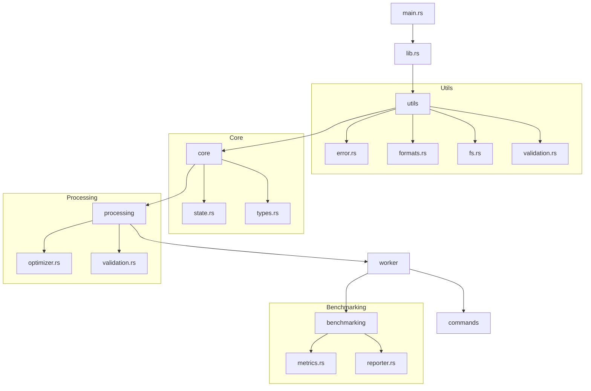
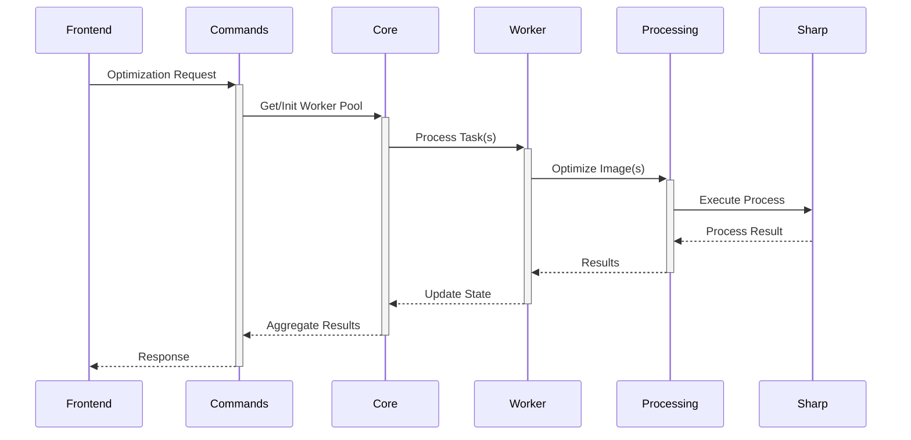
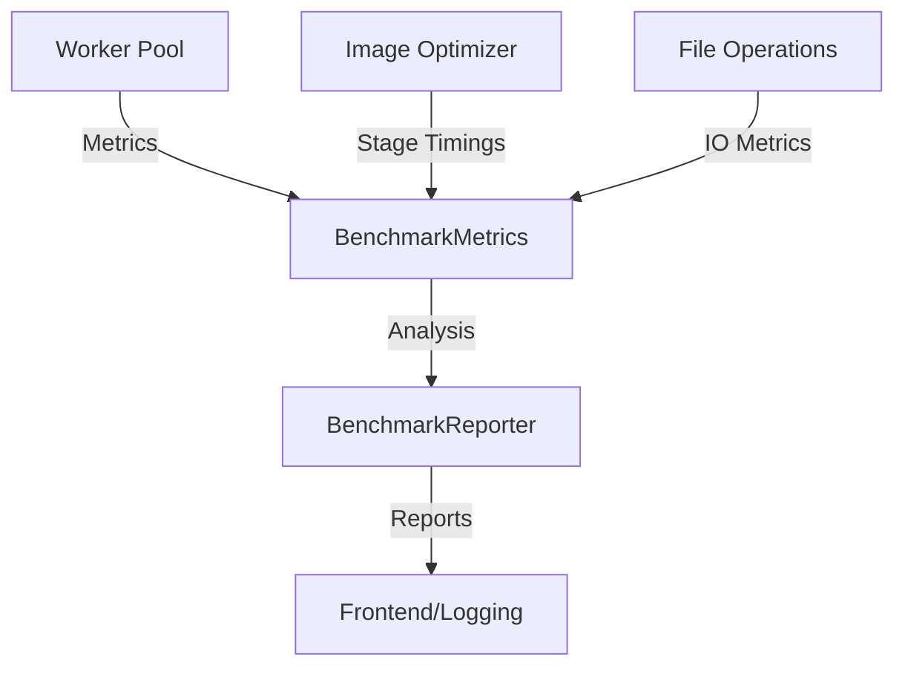

# Backend Architecture

## Core Files

### main.rs - Entry Point
The application's entry point that initializes the core systems.

```rust
// src-tauri/src/main.rs
#![cfg_attr(not(debug_assertions), windows_subsystem = "windows")]
```

**Key Features:**
- Windows console management in release mode
- Comprehensive logging setup with:
  - Debug level tracing with file/line info
  - Thread IDs and names for debugging
  - Structured log format for analysis
  - Configurable log levels (DEBUG in development)
- Application state initialization
- Error handling and panic recovery
- Plugin registration and setup

### lib.rs - Core Library
The main library configuration that sets up the application structure.

```rust
// src-tauri/src/lib.rs
pub mod utils;
pub mod core;
pub mod processing;
pub mod worker;
pub mod benchmarking;  // Performance tracking and analysis
mod commands;
```

**Components:**
1. **Module Structure**
   - `utils`: Base utilities and shared functionality
     - Error types and handling
     - Format-specific operations
     - File system utilities
     - Input validation
   - `core`: State management and shared types
     - Application state
     - Common data structures
     - Configuration types
   - `processing`: Image optimization logic
     - Sharp sidecar integration
     - Image processing pipeline
     - Validation rules
   - `worker`: Parallel processing pool
     - Worker management
     - Resource allocation
     - Task distribution
   - `benchmarking`: Performance tracking
     - Metrics collection
     - Performance analysis
     - Reporting capabilities
   - `commands`: Frontend-facing Tauri commands
     - Command handlers
     - IPC interface
     - Response formatting

2. **Tauri Plugins**
   - Process management (`tauri_plugin_process`)
     - Sidecar process control
     - Process lifecycle management
     - IPC with Sharp
   - File dialogs (`tauri_plugin_dialog`)
     - Native file pickers
     - Directory selection
   - File system operations (`tauri_plugin_fs`)
     - Secure file access
     - Directory operations
   - Shell commands (`tauri_plugin_shell`)
     - Command execution
     - Process spawning
   - File/URL opening (`tauri_plugin_opener`)
     - External file handling
     - URL scheme handling

## Architecture Overview



The architecture follows a modular design where:
- `main.rs` bootstraps the application
  - Initializes logging
  - Sets up error handlers
  - Configures plugins
  - Starts the event loop
- `lib.rs` orchestrates the components
  - Defines module hierarchy
  - Manages dependencies
  - Exposes public interface
- Each module has a specific responsibility
  - Clear separation of concerns
  - Minimal coupling
  - Focused functionality
- Dependencies flow from low-level to high-level components
  - Utils → Core → Processing → Worker → Commands
  - Worker → Benchmarking (for performance tracking)
  - Prevents dependency cycles
  - Simplifies testing
- Circular dependencies are eliminated through proper type placement
  - Common types in core module
  - Shared interfaces
  - Clear ownership boundaries
  - Metrics types in benchmarking module

## Modules

### Utils Module

The `utils` module provides foundational utilities used throughout the application.

#### Module Structure
```rust
// src-tauri/src/utils/mod.rs
mod error;    // Error types and handling
mod formats;  // Image format handling
mod fs;       // File system operations
mod validation; // Input validation

pub use error::{OptimizerError, OptimizerResult};
pub use formats::{ImageFormat, format_from_extension, get_default_quality};
pub use fs::{get_file_size, validate_path, ensure_parent_dir};
pub use validation::{validate_settings, validate_resize};
```

#### Error Handling (`error.rs`)
Centralized error types for consistent error handling.

**Key Components:**
1. **OptimizerError:**
   ```rust
   pub enum OptimizerError {
       InvalidPath(String),
       UnsupportedFormat(String),
       ValidationError(String),
       ProcessingError(String),
       IoError(std::io::Error),
   }
   ```
   - Structured error types for different failure cases
   - Conversion implementations for common error types
     ```rust
     impl From<std::io::Error> for OptimizerError
     impl From<serde_json::Error> for OptimizerError
     ```
   - Error context preservation through custom messages
   - Serializable for frontend communication
   - Debug and Display implementations

2. **Result Type:**
   ```rust
   pub type OptimizerResult<T> = Result<T, OptimizerError>;
   ```
   - Standardized result type across the application
   - Simplified error handling with `?` operator
   - Clear error propagation paths

#### Format Handling (`formats.rs`)
Manages image format-specific operations and validation.

**Key Features:**
1. **ImageFormat Enum:**
   ```rust
   pub enum ImageFormat {
       JPEG,
       PNG,
       WebP,
       AVIF,
       TIFF,
   }
   ```
   - Format detection from extensions
     ```rust
     pub fn format_from_extension(path: &str) -> OptimizerResult<ImageFormat>
     ```
   - Default quality values per format
     ```rust
     pub fn get_default_quality(format: &ImageFormat) -> u32
     ```
   - Format-specific validation rules
     ```rust
     pub fn validate_quality(format: &ImageFormat, quality: u32) -> bool
     ```
   - Conversion compatibility checks
     ```rust
     pub fn can_convert_to(from: &ImageFormat, to: &ImageFormat) -> bool
     ```
   - String representation for logging/display
   - Serialization support for IPC

2. **Quality Management:**
   ```rust
   pub struct QualitySettings {
       pub jpeg: Option<u32>,
       pub webp: Option<u32>,
       pub avif: Option<u32>,
   }
   ```
   - Format-specific quality controls
   - Default value handling
   - Validation rules
   - Conversion between formats

#### File System (`fs.rs`)
Handles all file system operations with proper error handling.

**Key Operations:**
1. **File Operations:**
   ```rust
   pub async fn get_file_size(path: &str) -> OptimizerResult<u64>
   pub async fn ensure_parent_dir(path: &str) -> OptimizerResult<()>
   pub async fn validate_path(path: &str) -> OptimizerResult<()>
   ```
   - File size retrieval with error handling
   - Directory creation and validation
   - Path validation and sanitization
   - Extension handling
   - Parent directory management

2. **Security Measures:**
   - Path normalization
   - Directory traversal prevention
   - Permission checks
   - Error context preservation

3. **Utility Functions:**
   ```rust
   pub fn get_extension(path: &str) -> Option<String>
   pub fn is_supported_extension(ext: &str) -> bool
   pub fn sanitize_path(path: &str) -> String
   ```
   - Extension extraction and validation
   - Path sanitization
   - Format detection support

### Core Module

The `core` module provides fundamental types and state management.

#### Module Structure
```rust
// src-tauri/src/core/mod.rs
mod state;  // Application state management
mod types;  // Shared type definitions

pub use state::{AppState, StateError};
pub use types::{ImageTask, ImageSettings, OptimizationResult};
```

#### Type System (`types.rs`)
Defines core data structures used throughout the application.

1. **Image Settings:**
   ```rust
   pub struct ImageSettings {
       pub quality: QualitySettings,
       pub resize: ResizeSettings,
       pub output_format: String,
   }

   pub struct ResizeSettings {
       pub width: Option<u32>,
       pub height: Option<u32>,
       pub maintain_aspect: bool,
       pub mode: ResizeMode,
       pub size: Option<u32>,
   }

   pub enum ResizeMode {
       Fit,
       Fill,
       Exact,
   }
   ```
   - Format-specific quality controls
     - JPEG, WebP, AVIF quality settings
     - Lossless mode support
   - Resize configurations
     - Dimension constraints
     - Aspect ratio handling
     - Multiple resize modes
   - Output format specification
     - Format validation
     - Conversion rules
   - Serialization support
     - JSON serialization for IPC
     - Custom serializers for enums

2. **Task Types:**
   ```rust
   pub struct ImageTask {
       pub input_path: String,
       pub output_path: String,
       pub settings: ImageSettings,
   }

   pub struct OptimizationResult {
       pub original_size: u64,
       pub optimized_size: u64,
       pub saved_bytes: i64,
       pub compression_ratio: f64,
       pub success: bool,
       pub error: Option<String>,
   }
   ```
   - Centralized task definition
     - Path validation
     - Settings validation
   - Used across worker and processing modules
     - Task distribution
     - Progress tracking
   - Serializable for IPC
     - Frontend communication
     - Result reporting

3. **State Management (`state.rs`)
Manages application-wide state with thread safety.

**Key Features:**
1. **Worker Pool Management:**
   ```rust
   pub struct AppState {
       worker_pool: Arc<Mutex<Option<WorkerPool>>>,
       config: Arc<AppConfig>,
   }

   impl AppState {
       pub fn new(app: AppHandle) -> Self
       pub async fn get_or_init_worker_pool(&self) -> OptimizerResult<Arc<WorkerPool>>
       pub async fn shutdown(&self) -> OptimizerResult<()>
   }
   ```
   - Thread-safe worker pool access
     - Mutex protection
     - Reference counting
   - Lazy initialization
     - On-demand creation
     - Resource efficiency
   - Graceful shutdown implementation
     - Task completion
     - Resource cleanup
   - Resource cleanup on drop
     - Automatic shutdown
     - Error handling

2. **Configuration Management:**
   ```rust
   pub struct AppConfig {
       pub max_workers: usize,
       pub batch_size: usize,
       pub timeout: Duration,
   }
   ```
   - Application-wide settings
   - Runtime configuration
   - Default values

### Processing Module

The `processing` module handles image optimization logic.

#### Module Structure
```rust
// src-tauri/src/processing/mod.rs
mod optimizer;    // Image optimization logic
mod validation;   // Input validation

pub use optimizer::{ImageOptimizer, OptimizeError};
pub use validation::{validate_task, ValidationError};
```

#### Image Optimizer (`optimizer.rs`)
Core image processing functionality using Sharp sidecar.

**Key Features:**
1. **Batch Processing:**
   ```rust
   pub struct ImageOptimizer {
       active_tasks: Arc<Mutex<HashSet<String>>>,
       batch_size: usize,
       timeout: Duration,
   }

   impl ImageOptimizer {
       pub async fn process_batch(&self, tasks: Vec<ImageTask>) -> OptimizerResult<Vec<OptimizationResult>>
       pub async fn process_chunk(&self, chunk: Vec<ImageTask>) -> OptimizerResult<Vec<OptimizationResult>>
   }
   ```
   - Efficient task tracking with HashSet
     - O(1) lookups
     - Automatic deduplication
   - Parallel processing support
     - Chunk-based processing
     - Configurable batch size
   - Progress monitoring
     - Task status tracking
     - Error aggregation
   - Resource cleanup
     - Automatic task removal
     - Error recovery

2. **Sharp Integration:**
   ```rust
   impl ImageOptimizer {
       async fn run_sharp_process(&self, task: &ImageTask) -> OptimizerResult<OptimizationResult>
       async fn run_sharp_process_batch(&self, tasks: &[ImageTask]) -> OptimizerResult<Vec<OptimizationResult>>
   }
   ```
   - Batch command processing
     - JSON command serialization
     - Result parsing
   - Optimized IPC communication
     - Reduced process spawning
     - Efficient data transfer
   - Error handling and recovery
     - Process timeout handling
     - Error context preservation
   - Performance monitoring
     - Size metrics
     - Timing information

3. **Validation (`validation.rs`)
Input validation and error checking.

**Key Features:**
1. **Path Validation:**
   ```rust
   pub async fn validate_paths(task: &ImageTask) -> OptimizerResult<()>
   ```
   - Input path existence
   - Output path validity
   - Permission checks
   - Format support

2. **Settings Validation:**
   ```rust
   pub fn validate_settings(settings: &ImageSettings) -> OptimizerResult<()>
   ```
   - Quality range checks
   - Resize constraints
   - Format compatibility
   - Default handling

3. **Format Validation:**
   ```rust
   pub fn validate_format(path: &str, settings: &ImageSettings) -> OptimizerResult<()>
   ```
   - Extension checking
   - Format support
   - Conversion rules
   - Quality constraints

### Worker Module

The `worker` module manages parallel processing.

#### Worker Pool (`worker/pool.rs`)
Handles concurrent image processing tasks.

**Key Features:**
1. **Resource Management:**
   ```rust
   pub struct WorkerPool {
       optimizer: ImageOptimizer,
       semaphore: Arc<Semaphore>,
       active_workers: Arc<AtomicUsize>,
       max_workers: usize,
   }

   impl WorkerPool {
       pub fn new(app: AppHandle, worker_count: Option<usize>) -> Self
       pub async fn process(&self, task: ImageTask) -> OptimizerResult<OptimizationResult>
       pub async fn process_batch(&self, tasks: Vec<ImageTask>) -> OptimizerResult<Vec<OptimizationResult>>
   }
   ```
   - Dynamic worker scaling
     - CPU core detection
     - Configurable limits
   - Semaphore-based concurrency
     - Resource limiting
     - Fair scheduling
   - Resource cleanup
     - Automatic worker cleanup
     - Error recovery
   - Error handling
     - Task-level errors
     - Pool-level errors

2. **Batch Processing:**
   ```rust
   impl WorkerPool {
       async fn process_chunk(&self, chunk: Vec<ImageTask>) -> OptimizerResult<Vec<OptimizationResult>>
       async fn rebalance_workers(&self) -> OptimizerResult<()>
   }
   ```
   - Efficient task distribution
     - Chunk-based processing
     - Load balancing
   - Progress tracking
     - Worker status
     - Task completion
   - Error handling per task
     - Individual task errors
     - Batch error aggregation
   - Resource balancing
     - Worker scaling
     - Resource allocation

### Command Interface Module

The `commands` module bridges frontend and backend.

#### Module Structure
```rust
// src-tauri/src/commands/mod.rs
mod image;   // Image optimization commands
mod worker;  // Worker pool management

pub use image::{optimize_image, optimize_images};
pub use worker::get_active_tasks;
```

#### Command Implementation
1. **Image Commands:**
   ```rust
   #[tauri::command]
   pub async fn optimize_image(
       app: AppHandle,
       state: State<'_, AppState>,
       task: ImageTask,
   ) -> Result<OptimizationResult, String>

   #[tauri::command]
   pub async fn optimize_images(
       app: AppHandle,
       state: State<'_, AppState>,
       tasks: Vec<ImageTask>,
   ) -> Result<Vec<OptimizationResult>, String>
   ```
   - Task validation
   - Worker pool management
   - Progress tracking
   - Error handling

2. **Worker Commands:**
   ```rust
   #[tauri::command]
   pub async fn get_active_tasks(
       state: State<'_, AppState>,
   ) -> Result<usize, String>
   ```
   - Worker status
   - Task counting
   - Error handling

#### Command Flow


### Benchmarking Module

The `benchmarking` module provides comprehensive performance tracking and analysis capabilities.

#### Module Structure
```rust
// src-tauri/src/benchmarking/mod.rs
mod metrics;    // Performance metrics collection
mod reporter;   // Metrics formatting and reporting

pub use metrics::{BenchmarkMetrics, Duration, ProcessingStage};
pub use reporter::BenchmarkReporter;
```

#### Performance Metrics (`metrics.rs`)
Collects and manages detailed performance data.

**Key Components:**
1. **Duration Type:**
   ```rust
   pub struct Duration(f64);

   impl Duration {
       pub fn new_unchecked(seconds: f64) -> Self
       pub fn as_secs_f64(&self) -> f64
       pub fn zero() -> Self
       pub fn is_valid(&self) -> bool
   }
   ```
   - Type-safe duration measurements
   - Validation and bounds checking
   - Arithmetic operations support
   - Human-readable formatting

2. **Benchmark Metrics:**
   ```rust
   pub struct BenchmarkMetrics {
       worker_metrics: WorkerPoolMetrics,
       compression_ratios: Vec<f64>,
       total_duration: Duration,
       stage_timings: HashMap<ProcessingStage, Duration>,
   }
   ```
   - Worker pool performance tracking
     - Queue length monitoring
     - Worker utilization metrics
     - Task distribution analysis
   - Compression effectiveness
     - Ratio statistics
     - Size reduction tracking
   - Stage-specific timing
     - Loading duration
     - Processing duration
     - Saving duration
   - Overall performance metrics
     - Total processing time
     - Resource utilization
     - Throughput calculations

#### Metrics Reporter (`reporter.rs`)
Formats and presents performance data.

**Key Features:**
1. **Report Generation:**
   ```rust
   pub struct BenchmarkReporter {
       metrics: BenchmarkMetrics,
   }

   impl BenchmarkReporter {
       pub fn from_metrics(metrics: BenchmarkMetrics) -> Self
       fn calculate_stage_percentage(&self, stage_time: Duration) -> Percentage
       fn calculate_worker_efficiency(&self, busy: Duration, total: Duration) -> Percentage
   }
   ```
   - Human-readable formatting
     - Stage breakdowns
     - Efficiency calculations
     - Size statistics
   - Performance analysis
     - Worker efficiency
     - Stage distribution
     - Bottleneck identification
   - Data visualization preparation
     - Percentage calculations
     - Ratio formatting
     - Time breakdowns

#### Integration Points
1. **Worker Pool Integration:**
   ```rust
   impl WorkerPool {
       fn record_metrics(&self, metrics: &mut BenchmarkMetrics)
       fn update_worker_stats(&self, metrics: &mut WorkerPoolMetrics)
   }
   ```
   - Real-time metric collection
   - Worker performance tracking
   - Resource utilization monitoring

2. **Processing Integration:**
   ```rust
   impl ImageOptimizer {
       fn record_optimization_metrics(&self, metrics: &mut BenchmarkMetrics)
       fn track_processing_stage(&self, stage: ProcessingStage)
   }
   ```
   - Stage timing collection
   - Compression ratio tracking
   - Performance data aggregation

#### Performance Analysis


1. **Data Collection:**
   - Automatic metric gathering
   - Low-overhead tracking
   - Thread-safe updates

2. **Analysis Features:**
   - Performance bottleneck detection
   - Resource utilization analysis
   - Optimization recommendations

3. **Reporting Capabilities:**
   - Detailed performance breakdowns
   - Statistical analysis
   - Trend identification

## Performance Optimizations

Recent optimizations include:
1. **Batch Processing:**
   - Reduced process spawning overhead
     - Single Sharp process for multiple tasks
     - Efficient command batching
   - Efficient task batching
     - Configurable batch sizes
     - Memory-aware chunking
   - Optimized Sharp communication
     - JSON command serialization
     - Bulk result processing

2. **Resource Management:**
   - HashSet for active tasks (O(1) operations)
     - Fast lookups
     - Automatic deduplication
   - Efficient worker pool scaling
     - Dynamic worker count
     - Resource-aware scaling
   - Proper resource cleanup
     - Automatic task cleanup
     - Memory management

3. **Module Organization:**
   - Eliminated circular dependencies
     - Clear module hierarchy
     - Type centralization
   - Optimized module initialization order
     - Dependency-based ordering
     - Lazy initialization
   - Centralized type definitions
     - Shared interfaces
     - Clear ownership
   - Dedicated benchmarking module
     - Isolated performance tracking
     - Low-overhead metrics collection
     - Efficient data aggregation

4. **Error Handling:**
   - Structured error types
     - Clear error categories
     - Context preservation
   - Consistent error propagation
     - Result type usage
     - Error conversion
   - Detailed error context
     - Error messages
     - Debug information

## Security Measures

1. **File System Access:**
   - Restricted to user-selected directories
     - Path validation
     - Permission checks
   - Path validation and sanitization
     - Directory traversal prevention
     - Path normalization
   - Permission checks before operations
     - Read/write permissions
     - Directory access

2. **Process Isolation:**
   - Sidecar process sandboxing
     - Limited permissions
     - Resource constraints
   - Resource usage limits
     - Memory limits
     - CPU usage control
   - Proper cleanup on errors
     - Process termination
     - Resource release

3. **Input Validation:**
   - Format-specific validation
     - Extension checking
     - Format support
   - Path sanitization
     - Path normalization
     - Security checks
   - Settings validation
     - Range checks
     - Format compatibility

## Error Recovery

1. **Process Recovery:**
   ```rust
   impl ImageOptimizer {
       async fn recover_from_error(&self, error: OptimizerError) -> OptimizerResult<()>
   }
   ```
   - Process restart on failure
   - State recovery
   - Resource cleanup

2. **Task Recovery:**
   ```rust
   impl WorkerPool {
       async fn handle_task_error(&self, task: ImageTask, error: OptimizerError) -> OptimizerResult<()>
   }
   ```
   - Task retry logic
   - Error reporting
   - Resource reallocation

3. **State Recovery:**
   ```rust
   impl AppState {
       async fn recover_worker_pool(&self) -> OptimizerResult<()>
   }
   ```
   - Pool reinitialization
   - Task queue recovery
   - Error handling

## Monitoring and Metrics

1. **Performance Metrics:**
   ```rust
   pub struct ProcessingMetrics {
       pub processed_files: usize,
       pub total_size: u64,
       pub saved_size: i64,
       pub processing_time: Duration,
   }
   ```
   - File counts
   - Size statistics
   - Timing information
   - Integration with benchmarking module

2. **Worker Metrics:**
   ```rust
   pub struct WorkerMetrics {
       pub active_workers: usize,
       pub queued_tasks: usize,
       pub completed_tasks: usize,
       pub failed_tasks: usize,
   }
   ```
   - Worker status
   - Task statistics
   - Error counts
   - Performance tracking via benchmarking

3. **System Metrics:**
   ```rust
   pub struct SystemMetrics {
       pub memory_usage: u64,
       pub cpu_usage: f32,
       pub disk_usage: u64,
   }
   ```
   - Resource usage
   - System load
   - Storage utilization
   - Benchmarking integration

4. **Benchmark Analysis:**
   - Real-time performance tracking
     - Stage-by-stage timing
     - Worker efficiency metrics
   - Resource utilization monitoring
     - CPU and memory usage
     - I/O operations
   - Optimization insights
     - Bottleneck identification
     - Performance recommendations
