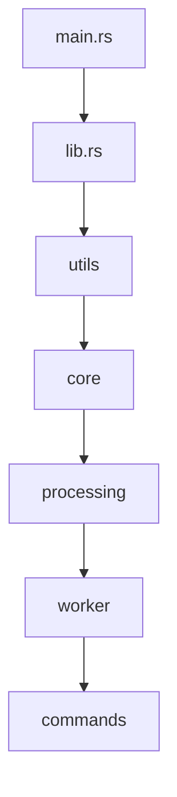
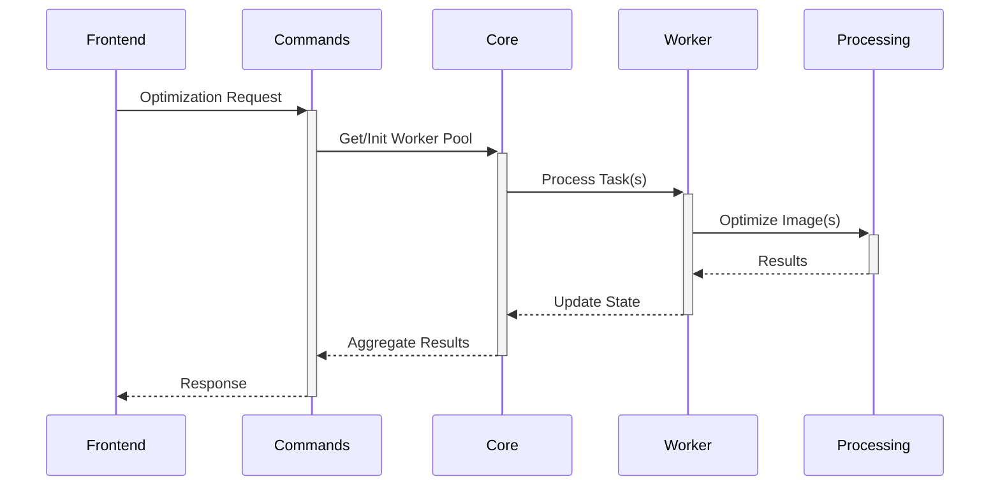

# Backend Architecture

## Core Files

### main.rs - Entry Point
The application's entry point that initializes the core systems.

```rust
// src-tauri/src/main.rs
#![cfg_attr(not(debug_assertions), windows_subsystem = "windows")]
```

**Key Features:**
- Windows console management in release mode
- Comprehensive logging setup with:
  - Debug level tracing
  - Thread tracking
  - File and line information
  - Structured log format

### lib.rs - Core Library
The main library configuration that sets up the application structure.

```rust
// src-tauri/src/lib.rs
pub mod utils;
pub mod core;
pub mod processing;
pub mod worker;
mod commands;
```

**Components:**
1. **Module Structure**
   - `utils`: Base utilities and shared functionality
   - `core`: State management and shared types
   - `processing`: Image optimization logic
   - `worker`: Parallel processing pool
   - `commands`: Frontend-facing Tauri commands

2. **Tauri Plugins**
   - Process management (`tauri_plugin_process`)
   - File dialogs (`tauri_plugin_dialog`)
   - File system operations (`tauri_plugin_fs`)
   - Shell commands (`tauri_plugin_shell`)
   - File/URL opening (`tauri_plugin_opener`)

## Architecture Overview



The architecture follows a modular design where:
- `main.rs` bootstraps the application
- `lib.rs` orchestrates the components
- Each module has a specific responsibility
- Dependencies flow from low-level to high-level components
- Circular dependencies are eliminated through proper type placement

## Utils Module

The `utils` module provides foundational utilities used throughout the application.

### Module Structure
```rust
// src-tauri/src/utils/mod.rs
mod error;    // Error types and handling
mod formats;  // Image format handling
mod fs;       // File system operations
mod validation; // Input validation
```

### Error Handling (`error.rs`)
Centralized error types for consistent error handling.

**Key Components:**
1. **OptimizerError:**
   - Structured error types for different failure cases
   - Conversion implementations for common error types
   - Error context preservation
   - Serializable for frontend communication

### Format Handling (`formats.rs`)
Manages image format-specific operations and validation.

**Key Features:**
1. **ImageFormat Enum:**
   ```rust
   pub enum ImageFormat {
       JPEG,
       AVIF,
       // ... other formats
   }
   ```
   - Format detection from extensions
   - Default quality values per format
   - Format-specific validation rules
   - Conversion compatibility checks

### File System (`fs.rs`)
Handles all file system operations with proper error handling.

**Key Operations:**
- File size retrieval
- Directory creation and validation
- Path validation and sanitization
- Extension handling
- Parent directory management

## Core Module

The `core` module provides fundamental types and state management.

### Module Structure
```rust
// src-tauri/src/core/mod.rs
mod state;  // Application state management
mod types;  // Shared type definitions
```

### Type System (`types.rs`)
Defines core data structures used throughout the application.

1. **Image Settings:**
   ```rust
   pub struct ImageSettings {
       pub quality: QualitySettings,
       pub resize: ResizeSettings,
       pub output_format: String,
   }
   ```
   - Format-specific quality controls
   - Resize configurations with aspect ratio handling
   - Output format specification

2. **Task Types:**
   ```rust
   pub struct ImageTask {
       pub input_path: String,
       pub output_path: String,
       pub settings: ImageSettings,
   }
   ```
   - Centralized task definition
   - Used across worker and processing modules
   - Serializable for IPC

### State Management (`state.rs`)
Manages application-wide state with thread safety.

**Key Features:**
1. **Worker Pool Management:**
   ```rust
   pub struct AppState {
       worker_pool: Arc<Mutex<Option<WorkerPool>>>
   }
   ```
   - Thread-safe worker pool access
   - Lazy initialization
   - Graceful shutdown implementation
   - Resource cleanup on drop

## Processing Module

The `processing` module handles image optimization logic.

### Module Structure
```rust
// src-tauri/src/processing/mod.rs
mod optimizer;    // Image optimization logic
mod validation;   // Input validation
```

### Image Optimizer (`optimizer.rs`)
Core image processing functionality using Sharp sidecar.

**Key Features:**
1. **Batch Processing:**
   ```rust
   pub struct ImageOptimizer {
       active_tasks: Arc<Mutex<HashSet<String>>>,
       // ... other fields
   }
   ```
   - Efficient task tracking with HashSet
   - Parallel processing support
   - Progress monitoring
   - Resource cleanup

2. **Sharp Integration:**
   - Batch command processing
   - Optimized IPC communication
   - Error handling and recovery
   - Performance monitoring

### Validation (`validation.rs`)
Input validation and error checking.

**Key Features:**
- Path validation using fs utilities
- Format validation using ImageFormat
- Settings validation with format-specific rules
- Error aggregation and reporting

## Worker Module

The `worker` module manages parallel processing.

### Worker Pool (`worker/pool.rs`)
Handles concurrent image processing tasks.

**Key Features:**
1. **Resource Management:**
   ```rust
   pub struct WorkerPool {
       optimizer: ImageOptimizer,
       semaphore: Arc<Semaphore>,
       // ... other fields
   }
   ```
   - Dynamic worker scaling
   - Semaphore-based concurrency
   - Resource cleanup
   - Error recovery

2. **Batch Processing:**
   - Efficient task distribution
   - Progress tracking
   - Error handling per task
   - Resource balancing

## Command Interface

The `commands` module bridges frontend and backend.

### Module Structure
```rust
// src-tauri/src/commands/mod.rs
mod image;   // Image optimization commands
mod worker;  // Worker pool management
```

### Command Flow


## Performance Optimizations

Recent optimizations include:
1. **Batch Processing:**
   - Reduced process spawning overhead
   - Efficient task batching
   - Optimized Sharp communication

2. **Resource Management:**
   - HashSet for active tasks (O(1) operations)
   - Efficient worker pool scaling
   - Proper resource cleanup

3. **Module Organization:**
   - Eliminated circular dependencies
   - Optimized module initialization order
   - Centralized type definitions

4. **Error Handling:**
   - Structured error types
   - Consistent error propagation
   - Detailed error context

## Security Measures

1. **File System Access:**
   - Restricted to user-selected directories
   - Path validation and sanitization
   - Permission checks before operations

2. **Process Isolation:**
   - Sidecar process sandboxing
   - Resource usage limits
   - Proper cleanup on errors

3. **Input Validation:**
   - Format-specific validation
   - Path sanitization
   - Settings validation
