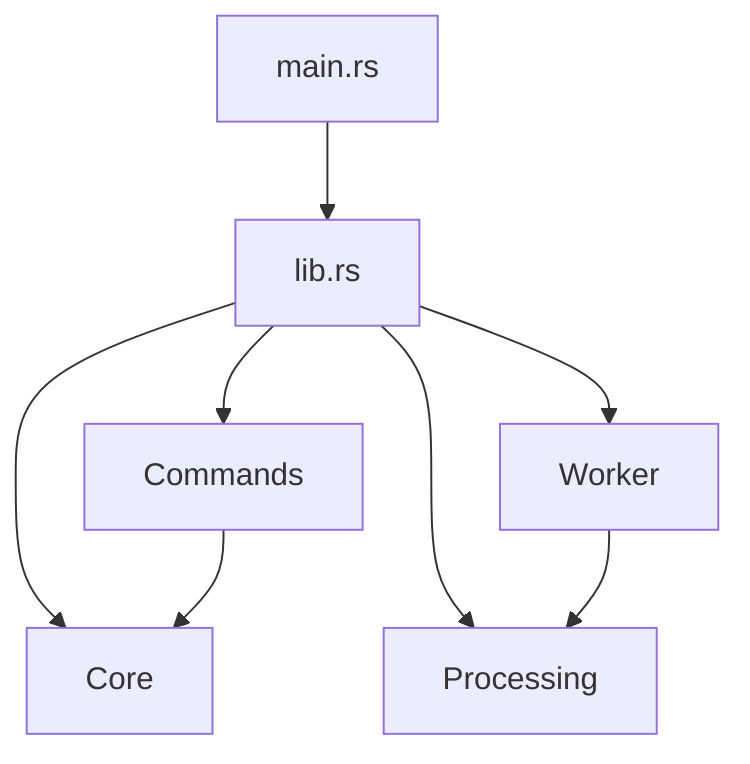
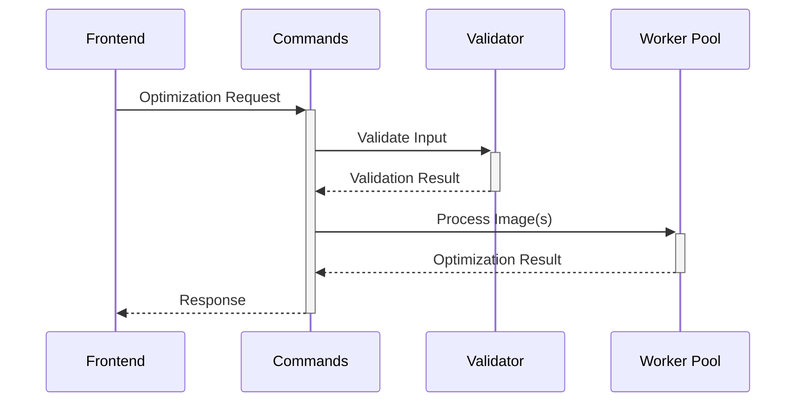
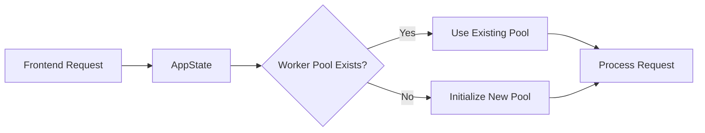
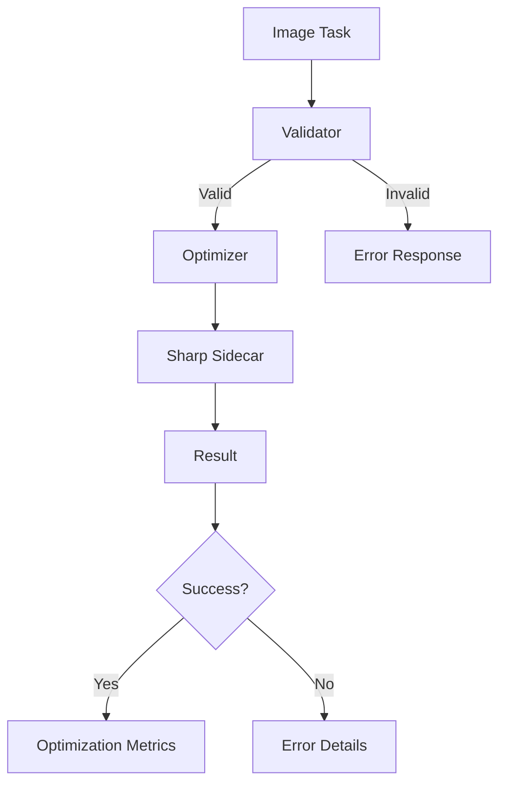
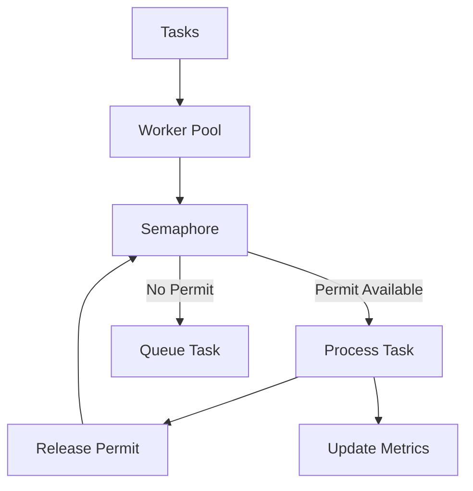
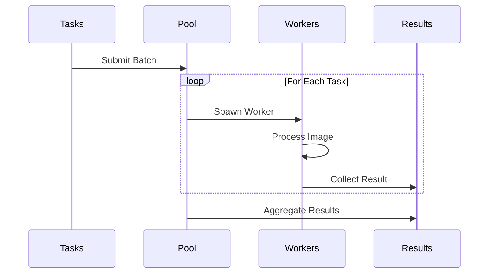
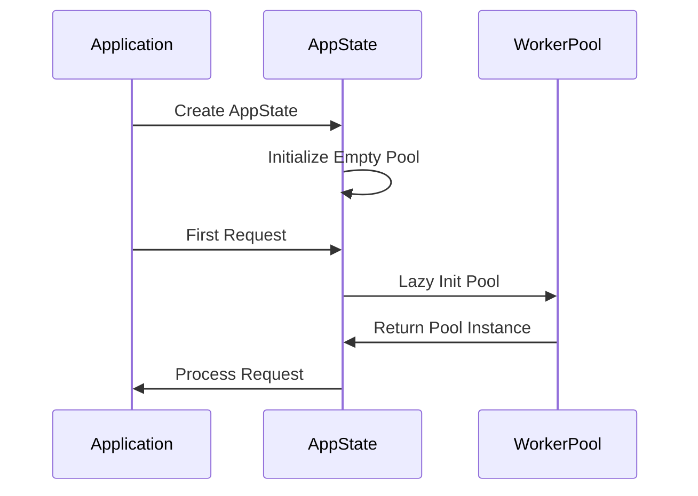

# Backend Architecture

## Core Files

### main.rs - Entry Point
The application's entry point that initializes the core systems.

```rust
// src-tauri/src/main.rs
#![cfg_attr(not(debug_assertions), windows_subsystem = "windows")]
```

**Key Features:**
- Windows console management in release mode
- Comprehensive logging setup with:
  - Debug level tracing
  - Thread tracking
  - File and line information
  - Structured log format

### lib.rs - Core Library
The main library configuration that sets up the application structure.

```rust
// src-tauri/src/lib.rs
mod commands;
pub mod core;
pub mod worker;
pub mod processing;
```

**Components:**
1. **Module Structure**
   - `commands`: Frontend-facing Tauri commands
   - `core`: State management and shared types
   - `worker`: Parallel processing pool
   - `processing`: Image optimization logic

2. **Tauri Plugins**
   - Process management (`tauri_plugin_process`)
   - File dialogs (`tauri_plugin_dialog`)
   - File system operations (`tauri_plugin_fs`)
   - Shell commands (`tauri_plugin_shell`)
   - File/URL opening (`tauri_plugin_opener`)

3. **Command Handlers**
   - `optimize_image`: Single image processing
   - `optimize_images`: Batch optimization
   - `get_active_tasks`: Worker status monitoring

## Architecture Overview



The architecture follows a modular design where:
- `main.rs` bootstraps the application
- `lib.rs` orchestrates the components
- Each module has a specific responsibility
- Dependencies flow from high-level to low-level components

## Command Interface

The `commands` module serves as the bridge between the frontend and backend, exposing Tauri commands for image optimization and worker management.

### Module Structure
```rust
// src-tauri/src/commands/mod.rs
mod image;   // Image optimization commands
mod worker;  // Worker pool management
```

### Image Commands (`image.rs`)
Handles image optimization requests from the frontend.

**Key Components:**
1. **Types:**
   ```rust
   pub struct BatchImageTask {
       pub input_path: String,
       pub output_path: String,
       pub settings: ImageSettings,
   }
   ```

2. **Commands:**
   - `optimize_image`: Process single image
     - Validates input task
     - Initializes worker pool if needed
     - Returns optimization result
   
   - `optimize_images`: Batch processing
     - Handles multiple images concurrently
     - Validates each task
     - Returns array of results

### Worker Commands (`worker.rs`)
Manages the worker pool state and monitoring.

**Commands:**
- `get_active_tasks`: Monitor worker pool
  - Returns current active worker count
  - Handles uninitialized pool state
  - Thread-safe state access

### Command Flow


## Core Module

The `core` module provides fundamental types and state management for the application.

### Module Structure
```rust
// src-tauri/src/core/mod.rs
mod state;  // Application state management
mod types;  // Shared type definitions
```

### Type System (`types.rs`)
Defines the core data structures used throughout the application.

1. **Image Settings:**
   ```rust
   pub struct ImageSettings {
       pub quality: QualitySettings,
       pub resize: ResizeSettings,
       pub output_format: String,
   }
   ```
   - `QualitySettings`: Format-specific quality controls
   - `ResizeSettings`: Image dimension configurations
   - Serializable for frontend-backend communication

2. **Optimization Results:**
   ```rust
   pub struct OptimizationResult {
       pub original_size: u64,
       pub optimized_size: u64,
       pub saved_bytes: i64,
       pub compression_ratio: f64,
       // ... other fields
   }
   ```
   - Tracks optimization metrics
   - Provides error handling
   - Serializable for frontend feedback

### State Management (`state.rs`)
Manages application-wide state using thread-safe patterns.

**Key Features:**
1. **Worker Pool Management:**
   ```rust
   pub struct AppState {
       worker_pool: Arc<Mutex<Option<WorkerPool>>>
   }
   ```
   - Thread-safe worker pool access
   - Lazy initialization
   - Singleton pattern implementation

2. **State Operations:**
   - `new()`: Create fresh application state
   - `get_or_init_worker_pool()`: Lazy worker pool initialization
   - Thread-safe state access patterns

### State Flow


The core module ensures:
- Type safety across the application
- Thread-safe state management
- Efficient resource utilization
- Clean frontend-backend communication

## Processing Module

The `processing` module handles image optimization and validation logic, serving as the core image processing engine.

### Module Structure
```rust
// src-tauri/src/processing/mod.rs
mod optimizer;    // Image optimization logic
mod validation;   // Input validation
```

### Image Optimizer (`optimizer.rs`)
Handles the core image processing functionality using Sharp as a sidecar process.

**Key Components:**
1. **Optimizer State:**
   ```rust
   pub struct ImageOptimizer {
       active_tasks: Arc<Mutex<Vec<String>>>
   }
   ```
   - Tracks active processing tasks
   - Thread-safe task management
   - Concurrent processing support

2. **Core Operations:**
   - `process_image`: Main image processing pipeline
     - Path validation
     - Directory creation
     - Size tracking
     - Sharp process execution
     - Metrics calculation
   
   - `run_sharp_process`: Sidecar process management
     - JSON settings serialization
     - Process execution
     - Error handling

### Image Validator (`validation.rs`)
Ensures input data integrity and validates processing parameters.

1. **Validation Types:**
   ```rust
   pub struct ValidationResult {
       pub is_valid: bool,
       pub error: Option<String>,
   }
   ```

2. **Validation Checks:**
   - Input path validation
     - File existence
     - Format support
     - Extension checking
   
   - Output path validation
     - Directory existence
     - Format compatibility
     - Path accessibility
   
   - Settings validation
     - Quality ranges (1-100)
     - Dimension constraints
     - Format compatibility

### Processing Flow


The processing module ensures:
- Robust input validation
- Efficient image processing
- Accurate optimization metrics
- Comprehensive error handling
- Safe concurrent processing

## Worker Module

The `worker` module implements a thread-safe, concurrent task processing system for image optimization.

### Module Structure
```rust
// src-tauri/src/worker/mod.rs
mod pool;    // Worker pool implementation
mod types;   // Task type definitions
```

### Task Types (`types.rs`)
Defines the core task structure for image processing.

```rust
pub struct ImageTask {
    pub input_path: String,
    pub output_path: String,
    pub settings: ImageSettings,
}
```
- Serializable task definition
- Contains all necessary processing parameters
- Used for both single and batch operations

### Worker Pool (`pool.rs`)
Implements a thread-safe, semaphore-controlled worker pool for concurrent image processing.

**Key Components:**
1. **Pool Structure:**
   ```rust
   pub struct WorkerPool {
       optimizer: ImageOptimizer,
       app: AppHandle,
       active_workers: Arc<Mutex<usize>>,
       semaphore: Arc<Semaphore>,
       worker_count: usize,
   }
   ```
   - Dynamic worker count based on CPU cores (2-8 workers)
   - Semaphore-based concurrency control
   - Thread-safe worker tracking
   - Shared optimizer instance

2. **Core Operations:**
   - `process`: Single task processing
     - Semaphore-controlled execution
     - Active worker tracking
     - Comprehensive logging
     - Error handling
   
   - `process_batch`: Concurrent batch processing
     - Parallel task execution
     - Progress tracking
     - Result aggregation
     - Success/failure statistics

### Concurrency Model


### Batch Processing Flow


The worker module ensures:
- Efficient resource utilization
- Controlled concurrency
- Robust error handling
- Comprehensive progress tracking
- Thread-safe operation
- Graceful task management

## Project Configuration

### Dependencies
```toml
[dependencies]
tokio = { version = "1.42.0", features = ["full", "time"] }
futures = "0.3.31"
num_cpus = "1.16.0"
crossbeam-channel = "0.5.14"
tracing = "0.1.41"
tracing-subscriber = "0.3.19"
parking_lot = "0.12.3"
lazy_static = "1.5.0"
sysinfo = "0.33.1"
```

### Build Configuration
- Release mode optimizations
- Windows-specific configurations
- Debug symbols management
- Sidecar binary packaging

### Error Handling
The command interface implements comprehensive error handling:
- Input validation errors
- Processing failures
- Resource allocation errors
- State management issues

### Response Types
```rust
// Common response patterns
Result<OptimizationResult, String>    // Single image
Result<Vec<OptimizationResult>, String> // Batch processing
Result<usize, String>                 // Worker metrics
```

### Thread Safety Guarantees
The core module provides the following thread safety mechanisms:
- Atomic reference counting (`Arc`)
- Mutex-protected shared state
- Interior mutability patterns
- Lock-free operations where possible

### State Initialization


### Supported Formats
| Format | Input | Output | Quality Range |
|--------|--------|---------|---------------|
| JPEG   | ✓      | ✓       | 1-100         |
| PNG    | ✓      | ✓       | 1-100         |
| WebP   | ✓      | ✓       | 1-100         |
| AVIF   | ✓      | ✓       | 1-100         |

### Sharp Configuration
- Sidecar process management
- Memory allocation limits
- Concurrent process limits
- Error recovery strategies

### Worker Lifecycle
1. **Initialization**
   - CPU core detection
   - Worker count calculation
   - Resource allocation
   - Semaphore setup

2. **Operation**
   - Task acquisition
   - Resource management
   - Progress tracking
   - Error handling

3. **Shutdown**
   - Task completion
   - Resource cleanup
   - Error reporting
   - State cleanup

### Performance Tuning
- Worker count: `min(max(2, cpu_count), 8)`
- Memory per worker: Dynamically allocated
- Batch size recommendations: Based on available resources
- Monitoring and metrics collection
