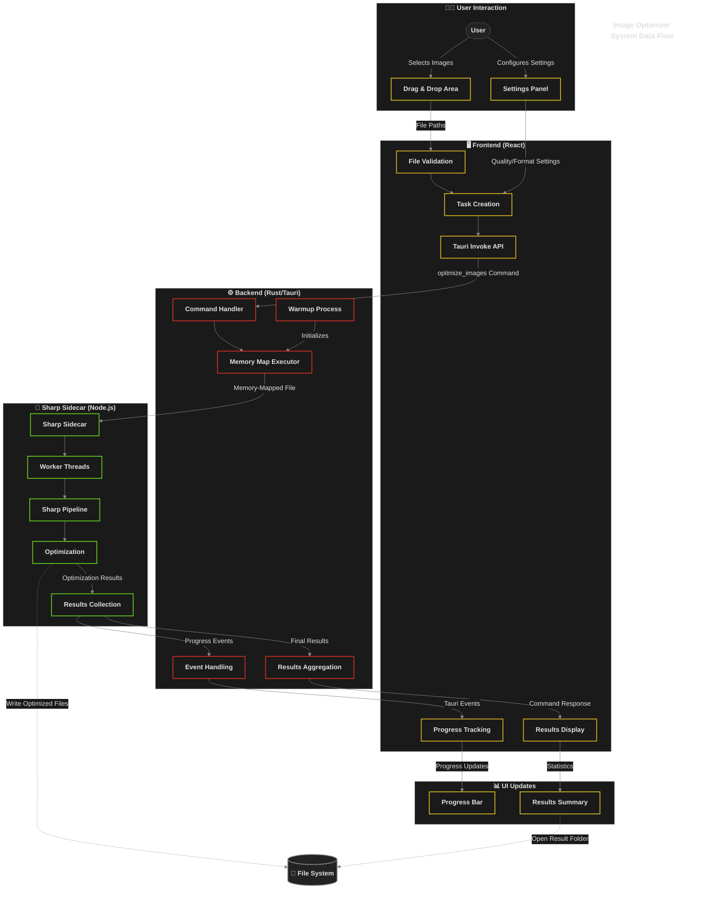

# Image Optimizer - Technical Documentation

## Summary
The Image Optimizer is a high-performance desktop application built with Tauri (Rust backend, React frontend) that provides efficient image compression and optimization. It leverages the Sharp library via a Node.js sidecar process to deliver professional-grade image processing while maintaining a responsive user interface. The application supports batch processing across multiple CPU cores, with real-time progress tracking and detailed optimization statistics.

| Key Feature | Description |
|-------------|-------------|
| Multiple Format Support | JPEG, PNG, WebP, AVIF with format-specific optimizations |
| Batch Processing | Process multiple images in parallel using a thread pool |
| Custom Settings | Per-format quality controls and resize options |
| Real-time Feedback | Live progress indicators and optimization statistics |

[Jump to Frontend](#12-frontend-react) | [Jump to Backend](#13-backend-taurirust) | [Jump to Image Processing](#14-image-processing) | [Jump to Development](#2-development-and-building)

## 1. System Architecture
### 1.1 High-Level Architecture

The Image Optimizer is built on a three-tier architecture that separates concerns between the user interface, system operations, and image processing.

#### Component Interactions and Data Flow

- **Frontend to Backend**: The React frontend communicates with the Rust backend using Tauri's invoke API to send commands like `optimize_image` and `optimize_images`.
- **Backend to Sharp Sidecar**: The Rust backend communicates with the Sharp sidecar using memory-mapped files for efficient data transfer, sending batches of up to 500 images at a time.
- **Events and Progress**: The sidecar emits progress events during processing that flow back to the frontend through Tauri's event system.

The optimization workflow follows these steps:
1. **Image Selection**: User selects images via drag-and-drop or file picker
2. **Task Creation**: Frontend creates optimization tasks with settings and sends them to the backend
3. **Task Processing**: Tasks are validated, batched, and transferred to the Sharp sidecar via memory-mapped files
4. **Result Handling**: Optimization results return to the frontend with statistics and file paths



### 1.2 Frontend (React) 

The frontend provides a clean and interactive user interface for image optimization tasks.

#### Key Components

- **App.jsx**: Main component managing application state, file handling, and task coordination
- **UI Components**: 
  - **FloatingMenu.jsx**: Settings panel for optimization configurations
  - **ProgressBar.jsx**: Visual display of optimization progress with metrics
  - **TitleBar.jsx**: Custom window controls
- **useProgressTracker.js**: Custom hook for managing progress state and statistics

#### State Management

The application uses React's state management to handle different states (IDLE, DRAGGING, PROCESSING, COMPLETED) and manages settings through a centralized state object:

```javascript
const [settings, setSettings] = useState({
  quality: { global: 90, jpeg: null, png: null, webp: null, avif: null },
  resize: { width: null, height: null, maintainAspect: true, mode: 'none' },
  outputFormat: 'original'
});
```

#### User Interface

- **Interaction Model**: Drag-and-drop interface with click-to-browse alternative
- **Feedback**: Real-time progress indicators showing completion percentage, size savings, and processing time
- **Settings**: Configurable options for quality, format, and resize operations

| Setting | Options | Description |
|---------|---------|-------------|
| Quality | 0-100 slider | Controls compression level |
| Resize Mode | None, Width, Height, Longest edge, Shortest edge | How images should be resized |
| Output Format | Original, JPEG, PNG, WebP, AVIF | Target format for conversion |

#### Tauri API Integration

The frontend integrates with Tauri's API through several plugins:

```javascript
// Core API functionality
import { invoke } from "@tauri-apps/api/core";
import { listen } from '@tauri-apps/api/event';
import { dirname, join } from '@tauri-apps/api/path';

// Plugin imports
import { mkdir } from "@tauri-apps/plugin-fs";
import { open } from "@tauri-apps/plugin-dialog";
```

Key plugins used:
- **plugin-fs**: File system operations for reading/writing images
- **plugin-dialog**: Native file dialogs for selecting images
- **plugin-shell**: Access to system shell for operations
- **plugin-process**: Management of subprocesses
- **plugin-opener**: Opens files in their default applications

#### Event System

The frontend and backend communicate through a bidirectional event system:

```javascript
// Listen for progress events from the backend
useEffect(() => {
  const unlisten = listen('optimization-progress', (event) => {
    // Handle progress updates from the sidecar
    updateProgress(event.payload);
  });
  
  return () => {
    unlisten.then(fn => fn()); // Cleanup listener
  };
}, []);
```

Events include:
- **optimization-start**: When processing begins on an image
- **optimization-progress**: Real-time updates during processing
- **optimization-complete**: When an image is fully processed
- **optimization-error**: Error notifications with details

#### Styling System

The frontend uses SCSS for styling, organized in a modular structure:

```
src/assets/styles/
├── main.scss           # Main entry point
├── base/               # Foundation styles
│   ├── _variables.scss # Global variables and colors
│   ├── _reset.scss     # CSS normalization
│   └── _typography.scss# Text styling
├── app/                # Application-level styles
│   └── _app.scss       # Main container and layouts
└── components/         # Component-specific styles
    ├── _FloatingMenu.scss
    ├── _ProgressBar.scss
    └── _TitleBar.scss
```

SCSS modules are linked using the `@use` directive, with variables namespaced for consistency (e.g., `@use '../base/variables' as v`). Component styles follow a modified BEM naming convention for maintainability. All styles are imported through a single entry point in `main.jsx` and processed by Vite during build.

### 1.3 Backend (Tauri/Rust)

The backend, built with Rust and Tauri, provides a robust foundation for image processing with efficient resource management and memory-mapped file communication.

#### Core Architecture and Key Modules

The backend is organized into several key modules:

- **Core**: Contains fundamental types and state management
  - **state.rs**: Manages application resources and provides dependency injection
  - **task.rs**: Defines task structures and warmup functionality
  - **types.rs**: Defines data structures for image settings and results
  - **progress.rs**: Handles progress reporting and metrics collection

- **Commands**: 
  - **image.rs**: Implements image processing commands (optimize_image, optimize_images) with support for large batches up to 500 images
  - **mod.rs**: Module exports

- **Processing**: Handles image optimization operations
  - **sharp/**: Communication with the Sharp sidecar via MemoryMapExecutor
  - **mod.rs**: Module exports

- **Utils**:
  - **error.rs**: Error handling and result types
  - **validation.rs**: Input validation logic
  - **formats.rs**: Image format utilities

- **Benchmarking** _(Enabled with feature flag)_:
  - **metrics.rs**: Performance metrics collection including warmup benefits
  - **reporter.rs**: Benchmark reporting mechanisms

#### Command API

The backend exposes several Tauri commands to the frontend:

```rust
#[tauri::command]
pub async fn optimize_image(
    app: tauri::AppHandle,
    state: State<'_, AppState>,
    input_path: String,
    output_path: String,
    settings: ImageSettings,
) -> OptimizerResult<OptimizationResult>
```

| Command | Purpose | Parameters |
|---------|---------|------------|
| optimize_image | Process a single image | input_path, output_path, settings |
| optimize_images | Batch processing (up to 500 images per batch) | tasks (array) |
| get_active_tasks | Status monitoring (returns empty array in current architecture) | none |

#### State Management

The backend uses a simplified `AppState` for resource management:

- **Memory-Mapped Execution**: Uses a MemoryMapExecutor for efficient data transfer
- **Thread Safety**: Uses Arc and Mutex for safe concurrent access
- **Resource Cleanup**: Proper shutdown of resources on application exit

```rust
pub struct AppState {
    pub(crate) app_handle: Arc<Mutex<Option<tauri::AppHandle>>>,
}
```

#### External Dependencies

The backend relies on several key Rust crates:
- **tauri**: Core framework for desktop applications
- **tokio**: Asynchronous runtime for non-blocking operations
- **serde**: Serialization and deserialization of data structures
- **tracing**: Structured logging and diagnostics
- **futures**: Tools for asynchronous programming
- **memmap2**: Memory-mapped file operations for high-performance IPC

#### Memory-Mapped Executor

The `MemoryMapExecutor` provides a high-performance approach to communicating with the Sharp sidecar:

- **Memory-Mapped Files**: Uses shared memory for zero-copy data transfer
- **Large Batch Support**: Supports batches of up to 500 images (increased from previous 75 limit)
- **Warmup Mechanism**: Initializes the Sharp environment at application startup
- **Progress Reporting**: Delegates to a dedicated ProgressHandler for real-time progress updates
- **Optimized Memory Advice**: Uses memory advise hints to optimize access patterns

```rust
pub struct MemoryMapExecutor {
    app: AppHandle,
    progress_handler: ProgressHandler,
}
```

#### Progress Handler

The `ProgressHandler` is responsible for managing progress updates during image optimization:

- **Message Processing**: Parses and processes different types of progress messages from the Sharp sidecar
- **User Feedback**: Formats user-friendly progress messages with details about optimization
- **Event Emission**: Emits Tauri events to update the frontend with progress information
- **Metadata Management**: Enriches progress updates with relevant metadata for the UI

```rust
pub struct ProgressHandler {
    app: AppHandle,
}
```

#### Warmup System

The application implements a warmup system to reduce the "cold start" penalty for the first image processing task:

- **Minimal Task**: Uses a tiny 1x1 pixel JPEG to initialize the Sharp sidecar without noticeable delay
- **Background Initialization**: Runs the warmup process asynchronously during application startup
- **Performance Benefits**: Significantly reduces the latency for the first image processed
- **Metrics Tracking**: In benchmark mode, tracks and reports the benefits of warmup

The warmup process is initiated in main.rs:

```rust
// Start warmup in a separate task so it doesn't block app startup
tauri::async_runtime::spawn(async move {
    // Add a small delay to ensure the app is fully initialized
    tokio::time::sleep(tokio::time::Duration::from_millis(500)).await;
    
    let state = app_handle.state::<AppState>();
    if let Err(e) = state.warmup_executor().await {
        debug!("Executor warmup failed: {}", e);
    } else {
        debug!("Executor warmup completed in the background");
    }
});
```

#### Error Handling

The backend implements a robust error handling system:

- **Custom Error Types**: Domain-specific errors with detailed context
- **Result Propagation**: Consistent error handling throughout the codebase
- **Graceful Recovery**: Clean shutdown on critical errors

#### Benchmarking Capabilities

The codebase includes conditional compilation for benchmarking features:

- **Feature Flags**: Toggle benchmarking with Rust feature flags
- **Performance Metrics**: Collect detailed timing information, including warmup benefits
- **Resource Monitoring**: Track CPU and memory usage during processing
- **Warmup Metrics**: Track performance difference between first task (after warmup) and subsequent tasks

### 1.4 Image Processing

The Sharp sidecar is a high-performance Node.js component that leverages the Sharp library to process images with optimal quality and speed.

#### Architecture

The Node.js sidecar follows a modular structure organized into four main components:

- **Processing**: Core image optimization logic that handles single-image and batch operations
- **Workers**: Multi-threading implementation that manages parallel processing across CPU cores
- **Config**: Format-specific settings with optimized presets for different image types
- **Utils**: Shared functions for file operations, progress reporting, and results formatting

#### Worker Thread Model

The sidecar implements a multi-threading architecture using Node.js worker threads to maximize CPU utilization. Each Sharp sidecar instance creates a pool of worker threads based on available CPU cores, allowing parallel processing of multiple images within a single sidecar process. This internal parallelism is why the application moved from a Rust-level process pool to a direct executor approach:

- **Internal Worker Threads**: The Sharp sidecar natively uses worker threads for parallel processing
- **Single Process Efficiency**: A single sidecar process efficiently utilizes all available CPU cores
- **Reduced Overhead**: The direct execution model eliminates redundant process management overhead
- **Warmup Optimization**: Pre-initializing the sidecar improves first-task performance

The coordinator thread distributes tasks to worker threads and collects results, ensuring balanced workload distribution and centralized progress tracking.

#### Worker Communication Protocol

The sidecar uses a structured message-passing protocol between the main thread and worker threads:

```javascript
// Main thread to worker
parentPort.postMessage({
  type: 'process',
  tasks: [/* array of image tasks */]
});

// Worker to main thread
parentPort.on('message', async ({ type, tasks }) => {
  if (type === 'process') {
    // Process tasks and send results back
  }
});
```

Message types include:
- **process**: Request to process a batch of images
- **cancel**: Signal to abort current processing
- **status**: Request for worker status information

Each task message contains complete information needed for processing:
```javascript
{
  input: '/path/to/input.jpg',
  output: '/path/to/output.jpg',
  settings: {
    quality: 85,
    format: 'jpeg',
    // Other processing parameters
  }
}
```

#### Progress Reporting System

The sidecar implements a detailed progress reporting system that provides real-time feedback:

```javascript
// Progress message structure
{
  type: 'progress',
  progressType: 'start|progress|complete|error',
  taskId: '/path/to/file.jpg',
  workerId: 2,
  fileName: 'image.jpg',
  // For complete messages, additional data:
  original_size: 1024000,
  optimized_size: 512000,
  saved_bytes: 512000,
  compression_ratio: 50,
  processing_time_ms: 350,
  formattedOriginalSize: '1.0 MB',
  formattedOptimizedSize: '512 KB',
  formattedSavedBytes: '512 KB',
  optimizationMessage: 'image.jpg optimized: 1.0 MB → 512 KB (50% reduction)'
}
```

Progress events flow from worker threads to the main thread, then to the Rust backend, and finally to the React frontend, creating a seamless progress tracking experience across the entire application stack.

#### External Dependencies

The Sharp sidecar relies on several key Node.js packages:
- **sharp**: Core image processing library with libvips bindings
- **worker_threads**: Node.js built-in module for multi-threading
- **fs/promises**: File system operations with Promise interface
- **path**: Path manipulation utilities

#### Image Processing Pipeline

The optimization pipeline processes each image through several stages:

1. **Input Analysis**: Extracts metadata and calculates original file size
2. **Format Configuration**: Applies optimal settings based on image format and quality requirements
3. **Resize Operations**: Performs intelligent resizing while preserving aspect ratio and quality
4. **Format Conversion**: Transforms between formats when requested by the user
5. **Compression**: Applies format-specific optimizations to reduce file size
6. **Statistics Generation**: Calculates and returns detailed optimization metrics

#### Format Support

The sidecar includes specialized optimizations for each supported format:

| Format | Implementation Details |
|--------|------------------------|
| JPEG   | Progressive encoding, optimal Huffman tables, chroma subsampling |
| PNG    | Palette reduction, dithering, zlib compression levels |
| WebP   | Near-lossless mode, alpha compression, preprocessing |
| AVIF   | Tile size optimization, color profile handling, effort level |

Format-specific settings are applied dynamically based on quality requirements, with special handling for lossless settings when maximum quality is requested.

#### Performance Optimizations

The sidecar incorporates several techniques to maximize performance:

- **Batch Processing**: Groups images for efficient handling
- **Adaptive Settings**: Optimizes parameters based on image content
- **Memory Management**: Streams large images to avoid memory issues
- **Real-time Feedback**: Provides progress updates during processing
- **Error Resilience**: Ensures graceful handling of problematic images without crashing the entire process

## 2. Development and Building

### 2.1 Prerequisites

- Node.js and npm for frontend development
- Rust toolchain for backend development
- Tauri CLI for application building
- pkg (for packaging the Node.js sidecar into an executable)

### 2.2 Build Process Overview

The build system handles three primary modes:

1. **Standard Development**: Builds the application with standard debugging capabilities
2. **Benchmarking Mode**: Enables detailed performance metrics and enhanced logging
3. **Production**: Creates optimized, distributable builds for target platforms

All build modes automatically compile the Sharp sidecar into a standalone executable before building the main application.

### 2.3 Sidecar Build Process

The Sharp sidecar is packaged as a self-contained executable using `pkg` and automatically integrated into the Tauri application:

```bash
# Build sidecar and rename for platform compatibility
npm run build:sharp

# This executes:
# 1. pkg --no-bytecode --public-packages "*" --public .  (packages Node.js app as executable)
# 2. node rename.js                                      (renames executable for Tauri integration)
```

The sidecar packaging process:
1. Compiles the Node.js application into a standalone executable for the current platform (Windows, macOS, or Linux)
2. Includes Sharp with platform-specific binaries and dependencies
3. Uses the Rust target triple (e.g., `x86_64-pc-windows-msvc` or `x86_64-apple-darwin`) to name the executable
4. Moves the executable to `src-tauri/binaries/` for Tauri to access

The pkg configuration in `sharp-sidecar/package.json` specifies:
```json
"pkg": {
  "assets": [
    "node_modules/sharp/**/*",
    "node_modules/@img/sharp-win32-x64/**/*",
    "node_modules/@img/sharp-darwin-x64/**/*",
    "node_modules/@img/sharp-darwin-arm64/**/*",
    "optimizationDefaults.js"
  ],
  "targets": [
    "node20-win-x64",
    "node20-macos-x64", 
    "node20-macos-arm64"
  ]
}
```

This ensures all native binaries and assets are correctly bundled in the executable for each supported platform.

#### Cross-Platform Compatibility

The build process includes robust platform detection and file management:

1. **Platform-Specific Binaries**: The sidecar is built for multiple target platforms including Windows (x64), macOS Intel (x64), and macOS Apple Silicon (arm64)
2. **Intelligent Executable Selection**: The rename script prioritizes the correct platform-specific binary when multiple are present
3. **Adaptive Naming**: Handles platform-specific naming conventions such as the `.exe` extension on Windows

The rename script (`rename.js`) uses the Rust target triple to determine the appropriate output filename:

```javascript
// Get platform-specific extension
const ext = platform === "win32" ? ".exe" : "";

// Map of possible source file names, prioritizing current platform
let possibleSourceFiles = [];

// First add platform-specific files based on current OS
if (platform === "darwin") {
  // macOS specific, prioritize correct architecture
  if (arch === "arm64") {
    possibleSourceFiles.push("sharp-sidecar-macos-arm64");
  } else {
    possibleSourceFiles.push("sharp-sidecar-macos-x64");
  }
} else if (platform === "win32") {
  // Windows specific
  possibleSourceFiles.push("sharp-sidecar-win-x64.exe");
}

// Rename to the Tauri-compatible format
const destPath = path.join(targetDir, `sharp-sidecar-${targetTriple}${ext}`);
```

This approach ensures that the build process works consistently across development environments and creates the appropriate executables for all supported platforms.

#### Library Dependency Handling

The Sharp sidecar requires several native libraries, particularly `libvips` for image processing. Platform-specific post-build scripts ensure these dependencies are correctly bundled and accessible at runtime:

##### macOS Dependency Management

On macOS, the `macos-post-build.sh` script handles dependency management with several key enhancements:

1. **Robust Binary Detection**: Automatically locates the sidecar binary if not explicitly provided:
   ```bash
   # If no binary path provided, try to find it in the target directory
   if [ -z "$BINARY_PATH" ]; then
     TARGET_DIR="../src-tauri/binaries"
     BINARY_PATH=$(find "$TARGET_DIR" -name "sharp-sidecar-*" -type f -not -name "*.exe" | head -n 1)
   fi
   ```

2. **Resilient Directory Creation**: Ensures all required directories exist for native modules:
   ```bash
   mkdir -p "../src-tauri/binaries/sharp/build/Release"
   mkdir -p "../src-tauri/binaries/sharp/vendor/lib"
   mkdir -p "../src-tauri/binaries/libs"
   ```

3. **Native Library Copying**: Automatically copies all libvips libraries to the correct locations:
   ```bash
   # Copy libvips libraries to the libs directory
   find "./node_modules/sharp/vendor/lib" -name "libvips*.dylib" -exec cp {} "../src-tauri/binaries/libs/" \;
   ```

4. **Fault Tolerance**: Continues execution even if certain operations fail, with appropriate warnings

5. **Dynamic Library Path Management**: During testing, the DYLD_LIBRARY_PATH environment variable is set to include the libs directory:
   ```bash
   # Manual setting of environment variable for testing
   export DYLD_LIBRARY_PATH="$PWD/src-tauri/binaries/libs:$DYLD_LIBRARY_PATH"
   ```

   This approach can be formalized in the production code by adding this to the command creation:
   ```rust
   // Potential enhancement to Rust code for library path management
   let libs_path = app_dir.join("libs").to_string_lossy().to_string();
   command.env("DYLD_LIBRARY_PATH", libs_path);
   ```

##### Testing and Verification

The build process includes a verification mechanism through test files that validate the sidecar's functionality:

1. **Test JSON Configuration**: A test.json file specifies sample optimization tasks:
   ```json
   [
     {
       "input": "/tmp/test.jpg",
       "output": "/tmp/test-output.jpg",
       "settings": {
         "quality": { "global": 90 },
         "resize": { "mode": "none", "maintainAspect": true },
         "outputFormat": "original"
       }
     }
   ]
   ```

2. **Benchmark Mode**: A special build configuration with enhanced logging and metrics:
   ```bash
   npm run tauri:benchmark   # Runs with --features benchmarking flag
   ```

3. **Library Path Validation**: Automatically verifies that all required libraries are accessible:
   ```
   Set SHARP_DIST_DIR to: /path/to/app/src-tauri/binaries/sharp
   Found Sharp native modules directory
   ```

These enhancements ensure consistent operation across development and production environments, with automatic handling of platform-specific library requirements and dependency paths.

### 2.4 Production Build

```bash
npm run tauri build
```

This creates optimized builds for target platforms (Windows, macOS) with:
- Minified frontend assets
- Optimized Rust binary
- Sharp sidecar bundled as a platform-specific executable
- Automatic platform-specific installers (MSI for Windows, DMG for macOS)

## 3. Technical Insights

The Image Optimizer's architecture has evolved through performance optimization. Key architectural insights include:

#### Process Pool Removal
The application originally used a ProcessPool in Rust to manage multiple Node.js sidecar processes. This was found to be unnecessarily complex and memory-intensive because:

- The Sharp sidecar already implements worker threads internally
- Multiple Node.js processes incurred high memory overhead
- Process management added complexity without proportional performance benefits

#### DirectExecutor Implementation
The architecture was simplified to use a DirectExecutor that directly spawns a Sharp sidecar process, along with a warmup mechanism:

- **Simplified Architecture**: Removed redundant layers of parallelism
- **Reduced Memory Usage**: Single Node.js process with worker threads uses less memory
- **Improved Startup Experience**: Pre-warming the sidecar eliminates cold start delays
- **Equivalent Performance**: For large batches, performance remains excellent due to Sharp's internal worker threads

#### Memory-Mapped File Communication
The most recent architectural improvement replaced command-line parameter passing with memory-mapped files:

- **Zero-Copy Performance**: Near zero-copy performance for large data transfers
- **Increased Batch Size**: Batch processing limit increased from 75 to 500 images
- **Removed Command Line Limitations**: Eliminated the 8,191 character Windows command line limit
- **Sequential Access Optimization**: Uses memory advice hints to optimize for sequential read patterns
- **Proper Resource Management**: Careful handling of memory-mapped resources with explicit cleanup
- **Cross-Platform Support**: Implementation designed to work consistently across Windows, macOS, and Linux

These evolutionary changes demonstrate how understanding the full stack (from Rust to Node.js to Sharp's internals) led to a more efficient architecture that is both simpler to maintain and more resource-efficient while maintaining high performance.

