# Image Optimizer - Technical Documentation

## Summary
The Image Optimizer is a high-performance desktop application built with Tauri (Rust backend, React frontend) that provides efficient image compression and optimization. It leverages the Sharp library via a Node.js sidecar process to deliver professional-grade image processing while maintaining a responsive user interface. The application supports batch processing across multiple CPU cores, with real-time progress tracking and detailed optimization statistics.

| Key Feature | Description |
|-------------|-------------|
| Multiple Format Support | JPEG, PNG, WebP, AVIF with format-specific optimizations |
| Batch Processing | Process multiple images in parallel using a thread pool |
| Custom Settings | Per-format quality controls and resize options |
| Real-time Feedback | Live progress indicators and optimization statistics |

[Jump to Frontend](#12-frontend-react) | [Jump to Backend](#13-backend-taurirust) | [Jump to Image Processing](#14-image-processing) | [Jump to Development](#2-development-and-building)

## 1. System Architecture
### 1.1 High-Level Architecture

The Image Optimizer is built on a three-tier architecture that separates concerns between the user interface, system operations, and image processing:


#### Component Interactions and Data Flow

- **Frontend to Backend**: The React frontend communicates with the Rust backend using Tauri's invoke API to send commands like `optimize_image` and `optimize_images`.
- **Backend to Sharp Sidecar**: The Rust backend manages a pool of Node.js processes that run the Sharp image processing library, communicating via JSON messages.
- **Events and Progress**: The sidecar emits progress events during processing that flow back to the frontend through Tauri's event system.

The optimization workflow follows these steps:
1. **Image Selection**: User selects images via drag-and-drop or file picker
2. **Task Creation**: Frontend creates optimization tasks with settings and sends them to the backend
3. **Task Processing**: Tasks are validated, batched, and distributed to Sharp workers
4. **Result Handling**: Optimization results return to the frontend with statistics and file paths

```mermaid
%%{init: {'theme': 'base', 'themeVariables': { 'primaryColor': '#232323', 'primaryTextColor': '#e0e0e0', 'primaryBorderColor': '#444', 'lineColor': '#888', 'secondaryColor': '#1a1a1a', 'tertiaryColor': '#333'}}}%%
flowchart TD
    %% Define subgraphs for better organization
    subgraph User["🧑‍💻 User Interaction"]
        direction TB
        User1([User]) -->|Selects Images| UI1[Drag & Drop Area]
        User1 -->|Configures Settings| UI2[Settings Panel]
    end
    
    subgraph Frontend["🖥️ Frontend (React)"]
        direction TB
        FE1[File Validation] --> FE2[Task Creation]
        FE2 --> FE3[Tauri Invoke API]
        FE4[Progress Tracking]
        FE5[Results Display]
    end
    
    subgraph Backend["⚙️ Backend (Rust/Tauri)"]
        direction TB
        BE1[Command Handler] --> BE2[Process Pool]
        BE2 --> BE3[Worker Management]
        BE4[Event Handling]
        BE5[Results Aggregation]
    end
    
    subgraph Sidecar["🔄 Sharp Sidecar (Node.js)"]
        direction TB
        SC1[Sharp Sidecar] --> SC2[Worker Threads]
        SC2 --> SC3[Sharp Pipeline]
        SC3 --> SC4[Optimization]
        SC5[Results Collection]
    end
    
    subgraph UI_Updates["📊 UI Updates"]
        direction TB
        UI3[Progress Bar]
        UI4[Results Summary]
    end
    
    %% Connect the subgraphs with labeled edges
    UI1 -->|File Paths| FE1
    UI2 -->|Quality/Format Settings| FE2
    
    FE3 -->|optimize_images Command| BE1
    
    BE3 -->|JSON Task Messages| SC1
    
    SC4 -->|Optimization Results| SC5
    SC5 -->|Progress Events| BE4
    BE4 -->|Tauri Events| FE4
    SC5 -->|Final Results| BE5
    BE5 -->|Command Response| FE5
    
    FE4 -->|Progress Updates| UI3
    FE5 -->|Statistics| UI4
    
    %% File System Operations
    SC4 -.->|Write Optimized Files| FS[(💾 File System)]
    UI4 -.->|Open Result Folder| FS
    
    %% Add a title
    Title[<b>Image Optimizer System Data Flow</b>]
    style Title fill:none,stroke:none,color:#e0e0e0,font-size:18px
    
    %% Enhanced styling based on app's color scheme
    classDef userStyle fill:#232323,stroke:#444,stroke-width:1px,color:#e0e0e0,font-weight:bold,rounded:true
    classDef frontendStyle fill:#1a1a1a,stroke:#d7b221,stroke-width:2px,color:#e0e0e0,font-weight:bold,rounded:true
    classDef backendStyle fill:#1a1a1a,stroke:#cd3120,stroke-width:2px,color:#e0e0e0,font-weight:bold,rounded:true
    classDef sidecarStyle fill:#1a1a1a,stroke:#62cd20,stroke-width:2px,color:#e0e0e0,font-weight:bold,rounded:true
    classDef uiStyle fill:#1a1a1a,stroke:#d7bb21,stroke-width:2px,color:#e0e0e0,font-weight:bold,rounded:true
    classDef storageStyle fill:#232323,stroke:#888,stroke-width:2px,color:#e0e0e0,font-weight:bold,shape:cylinder
    classDef subgraphStyle fill:#1a1a1a,stroke:#444,stroke-width:1px,color:#e0e0e0,font-weight:bold
    
    %% Apply enhanced styles
    class User1 userStyle
    class UI1,UI2,UI3,UI4 uiStyle
    class FE1,FE2,FE3,FE4,FE5 frontendStyle
    class BE1,BE2,BE3,BE4,BE5 backendStyle
    class SC1,SC2,SC3,SC4,SC5 sidecarStyle
    class FS storageStyle
    
    %% Style the subgraphs
    class User,Frontend,Backend,Sidecar,UI_Updates subgraphStyle
```



### 1.2 Frontend (React) 

The frontend provides a clean and interactive user interface for image optimization tasks.


#### Key Components

- **App.jsx**: Main component managing application state, file handling, and task coordination
- **UI Components**: 
  - **FloatingMenu.jsx**: Settings panel for optimization configurations
  - **ProgressBar.jsx**: Visual display of optimization progress with metrics
  - **TitleBar.jsx**: Custom window controls
- **useProgressTracker.js**: Custom hook for managing progress state and statistics

#### State Management

The application uses React's state management to handle different states (IDLE, DRAGGING, PROCESSING, COMPLETED) and manages settings through a centralized state object:

```javascript
const [settings, setSettings] = useState({
  quality: { global: 90, jpeg: null, png: null, webp: null, avif: null },
  resize: { width: null, height: null, maintainAspect: true, mode: 'none' },
  outputFormat: 'original'
});
```

#### User Interface

- **Interaction Model**: Drag-and-drop interface with click-to-browse alternative
- **Feedback**: Real-time progress indicators showing completion percentage, size savings, and processing time
- **Settings**: Configurable options for quality, format, and resize operations

| Setting | Options | Description |
|---------|---------|-------------|
| Quality | 0-100 slider | Controls compression level |
| Output Format | Original, JPEG, PNG, WebP, AVIF | Target format for conversion |
| Resize Mode | None, Width, Height, Scale | How images should be resized |
| Metadata | Keep, Strip | Whether to preserve image metadata |

#### Tauri API Integration

The frontend integrates with Tauri's API through several plugins:

```javascript
// Core API functionality
import { invoke } from "@tauri-apps/api/core";
import { listen } from '@tauri-apps/api/event';
import { dirname, join } from '@tauri-apps/api/path';

// Plugin imports
import { mkdir } from "@tauri-apps/plugin-fs";
import { open } from "@tauri-apps/plugin-dialog";
```

Key plugins used:
- **plugin-fs**: File system operations for reading/writing images
- **plugin-dialog**: Native file dialogs for selecting images
- **plugin-shell**: Access to system shell for operations
- **plugin-process**: Management of subprocesses
- **plugin-opener**: Opens files in their default applications

#### Event System

The frontend and backend communicate through a bidirectional event system:

```javascript
// Listen for progress events from the backend
useEffect(() => {
  const unlisten = listen('optimization-progress', (event) => {
    // Handle progress updates from the sidecar
    updateProgress(event.payload);
  });
  
  return () => {
    unlisten.then(fn => fn()); // Cleanup listener
  };
}, []);
```

Events include:
- **optimization-start**: When processing begins on an image
- **optimization-progress**: Real-time updates during processing
- **optimization-complete**: When an image is fully processed
- **optimization-error**: Error notifications with details

#### Styling System

The frontend uses SCSS for styling, organized in a modular structure:

```
src/assets/styles/
├── main.scss           # Main entry point
├── base/               # Foundation styles
│   ├── _variables.scss # Global variables and colors
│   ├── _reset.scss     # CSS normalization
│   └── _typography.scss# Text styling
├── app/                # Application-level styles
│   └── _app.scss       # Main container and layouts
└── components/         # Component-specific styles
    ├── _FloatingMenu.scss
    ├── _ProgressBar.scss
    └── _TitleBar.scss
```

SCSS modules are linked using the `@use` directive, with variables namespaced for consistency (e.g., `@use '../base/variables' as v`). Component styles follow a modified BEM naming convention for maintainability. All styles are imported through a single entry point in `main.jsx` and processed by Vite during build.

### 1.3 Backend (Tauri/Rust)

The backend, built with Rust and Tauri, provides a robust foundation for image processing with efficient resource management and parallel execution.


#### Core Architecture and Key Modules

The backend is organized into several key modules:

- **Core**: Contains fundamental types and state management
  - **state.rs**: Manages application resources and provides dependency injection
  - **types.rs**: Defines data structures for image settings and results
  - **progress.rs**: Handles progress reporting and metrics collection

- **Commands**: 
  - **image.rs**: Implements image processing commands (optimize_image, optimize_images)
  - **mod.rs**: Module exports

- **Processing**: Handles image optimization operations
  - **pool/**: Process pool implementation for parallel execution
  - **sharp/**: Communication with the Sharp sidecar
  - **batch/**: Batch processing logic and chunking

- **Utils**:
  - **error.rs**: Error handling and result types
  - **validation.rs**: Input validation logic
  - **formats.rs**: Image format utilities

- **Benchmarking** _(Enabled with feature flag)_:
  - **metrics.rs**: Performance metrics collection
  - **reporter.rs**: Benchmark reporting mechanisms

#### Command API

The backend exposes several Tauri commands to the frontend:

```rust
#[tauri::command]
pub async fn optimize_image(
    app: tauri::AppHandle,
    state: State<'_, AppState>,
    input_path: String,
    output_path: String,
    settings: ImageSettings,
) -> OptimizerResult<OptimizationResult>
```

| Command | Purpose | Parameters |
|---------|---------|------------|
| optimize_image | Process a single image | input_path, output_path, settings |
| optimize_images | Batch processing | tasks (array) |
| get_active_tasks | Status monitoring | none |

#### State Management

The backend uses a centralized `AppState` for resource management:

- **Lazy Initialization**: The process pool is created on first use
- **Thread Safety**: Uses Arc and Mutex for safe concurrent access
- **Resource Cleanup**: Proper shutdown of resources on application exit

```rust
pub struct AppState {
    pub(crate) process_pool: Arc<Mutex<Option<ProcessPool>>>,
}
```

#### External Dependencies

The backend relies on several key Rust crates:
- **tauri**: Core framework for desktop applications
- **tokio**: Asynchronous runtime for non-blocking operations
- **serde**: Serialization and deserialization of data structures
- **tracing**: Structured logging and diagnostics
- **futures**: Tools for asynchronous programming

#### Process Pool

The `ProcessPool` manages a collection of Node.js processes for concurrent image processing:

- **Dynamic Scaling**: Automatically scales based on available CPU cores
- **Resource Limiting**: Uses semaphores to control concurrency
- **Task Queuing**: Handles backpressure with a task queue
- **Batch Optimization**: Chunks large batches for efficient processing

```rust
pub struct ProcessPool {
    semaphore: Arc<Semaphore>,
    app: tauri::AppHandle,
    max_size: usize,
    batch_size: Arc<Mutex<usize>>,
    active_count: Arc<Mutex<usize>>,
    task_queue: Arc<Mutex<VecDeque<QueuedTask>>>,
}
```

#### Error Handling

The backend implements a robust error handling system:

- **Custom Error Types**: Domain-specific errors with detailed context
- **Result Propagation**: Consistent error handling throughout the codebase
- **Graceful Recovery**: Automatic retry for transient failures and clean shutdown on critical errors

#### Benchmarking Capabilities

The codebase includes conditional compilation for benchmarking features:

- **Feature Flags**: Toggle benchmarking with Rust feature flags
- **Performance Metrics**: Collect detailed timing information
- **Resource Monitoring**: Track CPU and memory usage during processing

### 1.4 Image Processing

The Sharp sidecar is a high-performance Node.js component that leverages the Sharp library to process images with optimal quality and speed.


#### Architecture

The Node.js sidecar follows a modular structure organized into four main components:

- **Processing**: Core image optimization logic that handles single-image and batch operations
- **Workers**: Multi-threading implementation that manages parallel processing across CPU cores
- **Config**: Format-specific settings with optimized presets for different image types
- **Utils**: Shared functions for file operations, progress reporting, and results formatting

#### Worker Thread Model

The sidecar implements a multi-threading architecture using Node.js worker threads to maximize CPU utilization. Rather than processing images sequentially, the system creates a pool of worker threads based on available CPU cores. Each thread operates independently, allowing simultaneous processing of multiple images while a coordinator manages task distribution and result collection.

Key capabilities include dynamic thread allocation, balanced workload distribution, centralized progress tracking, and isolated failure handling to prevent entire batch cancellation when individual images fail.

#### Worker Communication Protocol

The sidecar uses a structured message-passing protocol between the main thread and worker threads:

```javascript
// Main thread to worker
parentPort.postMessage({
  type: 'process',
  tasks: [/* array of image tasks */]
});

// Worker to main thread
parentPort.on('message', async ({ type, tasks }) => {
  if (type === 'process') {
    // Process tasks and send results back
  }
});
```

Message types include:
- **process**: Request to process a batch of images
- **cancel**: Signal to abort current processing
- **status**: Request for worker status information

Each task message contains complete information needed for processing:
```javascript
{
  input: '/path/to/input.jpg',
  output: '/path/to/output.jpg',
  settings: {
    quality: 85,
    format: 'jpeg',
    // Other processing parameters
  }
}
```

#### Progress Reporting System

The sidecar implements a detailed progress reporting system that provides real-time feedback:

```javascript
// Progress message structure
{
  type: 'progress',
  status: 'start|complete|error',
  path: '/path/to/file.jpg',
  data: {
    // Status-specific data (metrics, errors, etc.)
    workerId: 2,
    fileName: 'image.jpg',
    original_size: 1024000,
    optimized_size: 512000,
    saved_bytes: 512000,
    compression_ratio: 50,
    processing_time_ms: 350
  }
}
```

Progress events flow from worker threads to the main thread, then to the Rust backend, and finally to the React frontend, creating a seamless progress tracking experience across the entire application stack.

#### External Dependencies

The Sharp sidecar relies on several key Node.js packages:
- **sharp**: Core image processing library with libvips bindings
- **worker_threads**: Node.js built-in module for multi-threading
- **fs/promises**: File system operations with Promise interface
- **path**: Path manipulation utilities

#### Image Processing Pipeline

The optimization pipeline processes each image through several stages:

1. **Input Analysis**: Extracts metadata and calculates original file size
2. **Format Configuration**: Applies optimal settings based on image format and quality requirements
3. **Resize Operations**: Performs intelligent resizing while preserving aspect ratio and quality
4. **Format Conversion**: Transforms between formats when requested by the user
5. **Compression**: Applies format-specific optimizations to reduce file size
6. **Statistics Generation**: Calculates and returns detailed optimization metrics

#### Format Support

The sidecar includes specialized optimizations for each supported format:

| Format | Implementation Details |
|--------|------------------------|
| JPEG   | Progressive encoding, optimal Huffman tables, chroma subsampling |
| PNG    | Palette reduction, dithering, zlib compression levels |
| WebP   | Near-lossless mode, alpha compression, preprocessing |
| AVIF   | Tile size optimization, color profile handling, effort level |

Format-specific settings are applied dynamically based on quality requirements, with special handling for lossless settings when maximum quality is requested.

#### Performance Optimizations

The sidecar incorporates several techniques to maximize performance:

- **Batch Processing**: Groups images for efficient handling
- **Adaptive Settings**: Optimizes parameters based on image content
- **Memory Management**: Streams large images to avoid memory issues
- **Real-time Feedback**: Provides progress updates during processing
- **Error Resilience**: Ensures graceful handling of problematic images without crashing the entire process

## 2. Development and Building

### 2.1 Prerequisites

- Node.js and npm for frontend development
- Rust toolchain for backend development
- Tauri CLI for application building
- pkg (for packaging the Node.js sidecar into an executable)

### 2.2 Build Process Overview

The build system handles three primary modes:

1. **Standard Development**: Builds the application with standard debugging capabilities
2. **Benchmarking Mode**: Enables detailed performance metrics and enhanced logging
3. **Production**: Creates optimized, distributable builds for target platforms

All build modes automatically compile the Sharp sidecar into a standalone executable before building the main application.

### 2.3 Sidecar Build Process

The Sharp sidecar is packaged as a self-contained executable using `pkg` and automatically integrated into the Tauri application:

```bash
# Build sidecar and rename for platform compatibility
npm run build:sharp

# This executes:
# 1. pkg --no-bytecode --public-packages "*" --public .  (packages Node.js app as executable)
# 2. node rename.js                                      (renames executable for Tauri integration)
```

The sidecar packaging process:
1. Compiles the Node.js application into a standalone executable
2. Includes Sharp with platform-specific binaries and dependencies
3. Uses the Rust target triple (e.g., `x86_64-pc-windows-msvc`) to name the executable
4. Moves the executable to `src-tauri/binaries/` for Tauri to access

The pkg configuration in `sharp-sidecar/package.json` specifies:
```json
"pkg": {
  "assets": [
    "node_modules/sharp/**/*",
    "node_modules/@img/sharp-win32-x64/**/*",
    "optimizationDefaults.js"
  ],
  "targets": [
    "node20-win-x64"
  ]
}
```

This ensures all native binaries and assets are correctly bundled in the executable.

### 2.4 Production Build

```bash
npm run tauri build
```

This creates optimized builds for target platforms (Windows, macOS) with:
- Minified frontend assets
- Optimized Rust binary
- Sharp sidecar bundled as a platform-specific executable
- Automatic platform-specific installers (MSI for Windows, DMG for macOS)