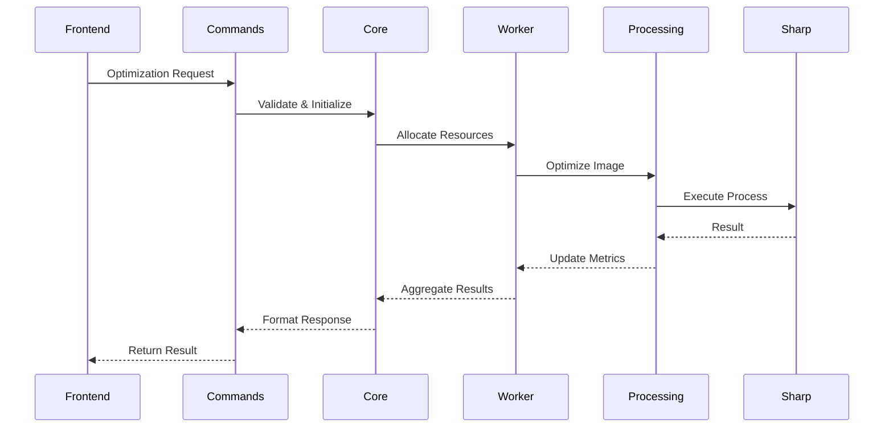

# Image Optimizer - Technical Documentation

## 1. Project Architecture & Workflow
The Image Optimizer is built with a modern, multi-layered architecture that combines React for the frontend, Rust for performance-critical operations, and Node.js for image processing. This design ensures both high performance and excellent user experience.

### 1.1 Frontend (React)
The frontend layer provides an intuitive user interface for image optimization, featuring drag-and-drop functionality, real-time progress tracking, and advanced settings controls.

# Core Components
These components form the backbone of the user interface, each serving a specific purpose in the application workflow.

1. **App.jsx** - Main Application Container
   The central component that orchestrates the entire application, managing state and coordinating between user interactions and backend processes.
   - Manages global state and event handling
   - Implements drag & drop interface
   - Coordinates image processing workflow
   - Implements real-time progress tracking with throttled updates ✨
   ```javascript
   function App() {
     const [isProcessing, setIsProcessing] = useState(false);
     const [isDragging, setIsDragging] = useState(false);
     const [optimizationStats, setOptimizationStats] = useState({
       totalFiles: 0,
       processedFiles: 0,
       elapsedTime: 0,
       currentFile: '',
       bytesProcessed: 0,
       bytesSaved: 0,
       estimatedTimeRemaining: 0,
       activeWorkers: 0
     });
     const [optimizationResults, setOptimizationResults] = useState([]);
     const processingRef = useRef(false);
     const [settings, setSettings] = useState({
       quality: {
         global: 90,
         jpeg: null,
         png: null,
         webp: null,
         avif: null
       },
       resize: {
         width: null,
         height: null,
         maintainAspect: true,
         mode: 'none',
         size: null
       },
       outputFormat: 'original'
     });
   }
   ```

2. **FloatingMenu.jsx** - Settings Interface
   A floating panel that provides users with fine-grained control over the optimization process.
   - Quality control
   - Resize options
   - Format selection
   - Advanced settings panel

3. **CpuMetrics.jsx** - Performance Monitoring ✨
   Real-time monitoring component that helps users understand system resource usage during optimization.
   - Real-time CPU usage tracking
   - Worker performance metrics
   - Task processing statistics
   ```javascript
   function CpuMetrics() {
     const [metrics, setMetrics] = useState([]);
     // Updates metrics every second
     useEffect(() => {
       const interval = setInterval(fetchMetrics, 1000);
       return () => clearInterval(interval);
     }, []);
   }
   ```

# State Management
The application uses React's state management to handle various aspects of the optimization process, from user settings to progress tracking.

1. **Processing State**
   Core state variables that track the current status of image processing operations.
   ```javascript
   const [isProcessing, setIsProcessing] = useState(false);
   const [isDragging, setIsDragging] = useState(false);
   const processingRef = useRef(false); // Prevents concurrent processing
   ```

2. **Optimization Settings**
   Comprehensive settings configuration that allows fine-tuned control over the optimization process.
   ```javascript
   const [settings, setSettings] = useState({
     quality: {
       global: 90,
       jpeg: null,
       png: null,
       webp: null,
       avif: null
     },
     resize: {
       width: null,
       height: null,
       maintainAspect: true,
       mode: 'none',
       size: null
     },
     outputFormat: 'original'
   });
   ```

3. **Progress Tracking** ✨
   Real-time tracking of optimization progress, providing users with detailed feedback about the process.
   - Atomic progress updates via event listeners
   - Throttled UI updates to prevent performance issues
   - Accurate ETA calculations based on processing history
   - Real-time worker performance monitoring
   ```javascript
   useEffect(() => {
     const unsubscribeProgress = listen("optimization_progress", (event) => {
       const progress = event.payload;
       setOptimizationStats({
         totalFiles: progress.total_files,
         processedFiles: progress.processed_files,
         currentFile: progress.current_file,
         elapsedTime: progress.elapsed_time.toFixed(2),
         bytesProcessed: progress.bytes_processed,
         bytesSaved: progress.bytes_saved,
         estimatedTimeRemaining: progress.estimated_time_remaining.toFixed(2),
         activeWorkers: progress.active_workers
       });
     });
   }, []);
   ```

# Event Handling & Data Flow
The event system manages user interactions and provides real-time feedback during the optimization process.

1. **Progress Events** ✨
   Real-time progress updates that keep users informed about the current state of optimization.
   ```javascript
   useEffect(() => {
     const unsubscribeProgress = listen("optimization_progress", (event) => {
       const progress = event.payload;
       setOptimizationStats({
         totalFiles: progress.total_files,
         processedFiles: progress.processed_files,
         currentFile: progress.current_file,
         elapsedTime: progress.elapsed_time,
         bytesProcessed: progress.bytes_processed,
         bytesSaved: progress.bytes_saved,
         estimatedTimeRemaining: progress.estimated_time_remaining,
         activeWorkers: progress.active_workers
       });
     });
   }, []);
   ```

2. **Batch Processing Pipeline** ✨
   Efficient handling of multiple images, including directory creation and task distribution.
   ```javascript
   // Create all required directories first
   await Promise.all(paths.map(async (path) => {
     const parentDir = await dirname(path);
     const optimizedPath = await join(parentDir, 'optimized');
     await mkdir(optimizedPath, { recursive: true });
   }));

   // Create batch tasks
   const tasks = await Promise.all(paths.map(async (path) => {
     const parentDir = await dirname(path);
     const fileName = path.split('\\').pop();
     const optimizedPath = await join(parentDir, 'optimized', fileName);
     return [path, optimizedPath, settings];
   }));

   // Process batch
   const results = await invoke('optimize_images', { tasks });
   ```

### 1.2 Backend (Tauri/Rust)
The Rust backend is built with a modular architecture that provides high-performance image processing capabilities while managing system resources efficiently. The system is divided into several key modules, each with specific responsibilities.

# Module Organization
The backend is organized into four primary modules:

1. **Commands Module**
   - Frontend-facing Tauri commands interface
   - Single and batch image optimization
   - Worker pool monitoring
   - Error handling and validation

2. **Core Module**
   - Application state management
   - Type definitions for settings and results
   - Thread-safe worker pool access
   - Serializable data structures

3. **Processing Module**
   - Image optimization using Sharp sidecar
   - Input/output validation
   - Format-specific optimizations
   - Progress tracking and metrics

4. **Worker Module**
   - Thread-safe worker pool (2-8 workers)
   - Semaphore-based concurrency control
   - Batch processing capabilities
   - Resource management

# Key Features
- Adaptive worker pool based on CPU cores
- Thread-safe state management
- Comprehensive error handling
- Real-time progress tracking
- Format-specific optimizations
- Efficient batch processing

# Data Flow


# Performance Considerations
- Dynamic worker scaling
- Memory-efficient processing
- Throttled progress updates
- Parallel batch processing
- Resource cleanup guarantees
- Optimized sidecar communication

### 1.3 Node.js Sidecar (Sharp)
The Sharp sidecar provides professional-grade image processing capabilities through a well-optimized Node.js implementation.

# Image Processing Logic
Advanced image processing algorithms that ensure optimal quality and compression.

1. **Format-Specific Optimizations**
   Tailored optimization settings for each supported image format.
   ```javascript
   const getLosslessSettings = (format) => {
     switch (format) {
       case 'jpeg':
         return {
           quality: 100,
           mozjpeg: true,
           chromaSubsampling: '4:4:4',
           optimiseCoding: true
         };
       case 'png':
         return {
           compressionLevel: 9,
           palette: false,
           quality: 100,
           effort: 10,
           adaptiveFiltering: true,
         };
       // ... other formats
     }
   };
   ```

2. **Resize Operations**
   Intelligent image resizing with multiple modes and aspect ratio preservation.
   ```javascript
   switch (settings.resize.mode) {
     case 'width':
       image = image.resize(size, null, { 
         withoutEnlargement: true,
         fit: 'inside'
       });
       break;
     case 'height':
       image = image.resize(null, size, { 
         withoutEnlargement: true,
         fit: 'inside'
       });
       break;
     // ... other modes
   }
   ```

3. **Quality Control**
   Fine-grained quality management with format-specific optimizations.
   ```javascript
   let formatOptions;
   if (settings?.quality?.global === 100) {
     formatOptions = getLosslessSettings(outputFormat);
   } else {
     formatOptions = { ...optimizationDefaults[outputFormat] };
     if (settings?.quality) {
       if (settings.quality[outputFormat] !== null) {
         formatOptions.quality = settings.quality[outputFormat];
       } else if (settings.quality.global !== null) {
         formatOptions.quality = settings.quality.global;
       }
     }
   }
   ```

# Sharp Configuration
Optimized Sharp.js configuration for maximum performance and quality.

1. Default Optimization Settings:
   Pre-configured optimization parameters for common use cases.
   - Format-specific presets (JPEG, PNG, WebP, AVIF, TIFF)
   - Quality and compression parameters
   - Advanced format-specific options (e.g., mozjpeg, chromaSubsampling)

2. Lossless Mode:
   Special handling for cases where maximum quality is required.
   - Activated when quality is set to 100
   - Format-specific lossless configurations
   - Maximum quality preservation settings

# Error Handling
Comprehensive error management system for reliable operation.
- Input validation and format checking
- Detailed error logging to stderr
- Process exit codes for error states
- Error propagation back to Rust backend

# Build Process
The build system ensures reliable packaging and distribution of the application across different platforms.

The sidecar is compiled into a standalone executable using @yao-pkg/pkg:
- Bundles all dependencies
- Platform-specific binaries
- Automatic renaming based on target triple
- Assets inclusion (Sharp binaries, defaults)

### 1.4 Build Process
The build process is designed to create a seamless, platform-specific executable that bundles all necessary components.

# Development Build Flow
A carefully orchestrated build sequence that ensures all components are properly compiled and packaged.

When running `npm run tauri dev`, the following process occurs:

1. The `tauri` script in root package.json first runs `build:sharp`:
   Initial build step that prepares the Sharp sidecar.
   ```json
   "scripts": {
     "build:sharp": "cd sharp-sidecar && npm run build:rename",
     "tauri": "npm run build:sharp && tauri"
   }
   ```

2. Inside sharp-sidecar directory:
   Compilation of the Sharp sidecar into a standalone executable.
   - `build:rename` script executes: `npm run build && node rename.js`
   - `build` uses @yao-pkg/pkg to create standalone executable:
     ```json
     "pkg": {
       "assets": [
         "node_modules/sharp/**/*",
         "node_modules/@img/sharp-win32-x64/**/*",
         "optimizationDefaults.js"
       ],
       "targets": ["node20-win-x64"]
     }
     ```

3. The rename script:
   Platform-specific binary naming and placement.
   - Detects platform (adds .exe extension on Windows)
   - Gets Rust target triple using `rustc -vV`
   - Moves executable to Tauri's binary directory:
     `sharp-sidecar.exe → src-tauri/binaries/sharp-sidecar-{target-triple}.exe`

4. Tauri configuration includes the binary:
   Integration of the sidecar with the main application.
   ```json
   "bundle": {
     "externalBin": [
       "binaries/sharp-sidecar"
     ]
   }
   ```

This process ensures the Sharp sidecar is:
- Compiled as a standalone executable
- Named correctly for the target platform
- Placed where Tauri can access it
- Bundled with the final application

### 1.5 Inter-Process Communication

The application uses a multi-layered communication system to coordinate between the React frontend, Rust backend, and Node.js sidecar. This architecture ensures efficient image processing while maintaining a responsive user interface.

# Communication Layers
```
Frontend (React) ←→ Backend (Rust) ←→ Sidecar (Sharp)
     Tauri IPC        Process Control
```

# Frontend → Backend Flow
The frontend communicates with the Rust backend through Tauri's IPC system, using both commands for direct actions and event listeners for continuous updates.

1. **Tauri Commands** - Direct function calls from frontend to backend
   ```javascript
   // Single image optimization
   const result = await invoke('optimize_image', { 
     inputPath: path, 
     outputPath: optimizedPath,
     settings: settings
   });

   // Batch optimization
   const results = await invoke('optimize_images', { tasks });

   // Worker status
   const activeWorkers = await invoke('get_active_tasks');
   ```

2. **Event Listeners** - Real-time updates and user interactions
   ```javascript
   // Progress tracking with throttled updates
   const unsubscribeProgress = listen("optimization_progress", (event) => {
     const progress = event.payload;
     setOptimizationStats({
       totalFiles: progress.total_files,
       processedFiles: progress.processed_files,
       currentFile: progress.current_file,
       elapsedTime: progress.elapsed_time,
       bytesProcessed: progress.bytes_processed,
       bytesSaved: progress.bytes_saved,
       estimatedTimeRemaining: progress.estimated_time_remaining,
       activeWorkers: progress.active_workers
     });
   });
   ```

# Backend → Sidecar Flow
The Rust backend manages a pool of workers that process images using the Sharp sidecar, with efficient resource management and error handling.

1. **Worker Pool Management**
   ```rust
   pub struct WorkerPool {
       optimizer: ImageOptimizer,
       app: AppHandle,
       active_workers: Arc<Mutex<usize>>,
       semaphore: Arc<Semaphore>,
       worker_count: usize,
   }
   ```
   - Dynamic worker scaling (2-8 workers)
   - Semaphore-based concurrency control
   - Thread-safe worker tracking
   - Graceful error handling

2. **Task Processing**
   ```rust
   pub async fn process(&self, task: ImageTask) -> Result<OptimizationResult, String> {
       let _permit = self.semaphore.acquire().await?;
       let mut count = self.active_workers.lock().await;
       *count += 1;
       
       let result = self.optimizer.process_image(&self.app, task).await;
       
       *count -= 1;
       result
   }
   ```
   - Asynchronous task execution
   - Resource cleanup on completion
   - Detailed error propagation
   - Progress tracking

3. **Batch Processing**
   ```rust
   pub async fn process_batch(&self, tasks: Vec<ImageTask>) -> Result<Vec<OptimizationResult>, String> {
       let mut handles = Vec::with_capacity(tasks.len());
       for task in tasks {
           handles.push(tokio::spawn(self.process(task)));
       }
       // Collect and aggregate results...
   }
   ```
   - Parallel task execution
   - Order-independent processing
   - Aggregated error handling
   - Progress tracking per task

# Error Handling & Recovery
The system implements comprehensive error handling across all communication layers:

1. **Frontend Layer**
   ```javascript
   try {
     const result = await invoke('optimize_image', {...});
   } catch (error) {
     console.error(`Error processing ${path}:`, error);
   }
   ```
   - User-friendly error messages
   - Graceful UI updates
   - Retry mechanisms

2. **Backend Layer**
   ```rust
   pub async fn process(&self, task: ImageTask) -> Result<OptimizationResult, String> {
       self.semaphore.acquire().await.map_err(|e| e.to_string())?;
       // Process with error handling...
   }
   ```
   - Structured error types
   - Resource cleanup on failure
   - Error context preservation

3. **Sidecar Layer**
   - Process exit code handling
   - stderr capture and parsing
   - Timeout management
   - Resource cleanup

# Security Measures
1. **Command Validation**
   ```json
   {
     "identifier": "shell:allow-execute",
     "allow": [{
       "name": "binaries/sharp-sidecar",
       "sidecar": true,
       "args": [
         "optimize",
         {"validator": "\\S+"},
         {"validator": "\\S+"},
         {"validator": ".*"}
       ]
     }]
   }
   ```
   - Strict argument validation
   - Path sanitization
   - Permission checks

2. **Resource Protection**
   - Memory usage limits
   - CPU usage monitoring
   - File system access control
   - Process isolation

# Data Types
The application uses strongly-typed data structures to ensure type safety and clear communication between layers.

1. **Optimization Settings** - Configuration for image processing
   ```rust
   #[derive(Debug, Serialize, Deserialize, Clone)]
   pub struct ImageSettings {
       quality: QualitySettings,
       resize: ResizeSettings,
       #[serde(rename = "outputFormat")]
       output_format: String
   }

   #[derive(Debug, Serialize, Deserialize, Clone)]
   pub struct QualitySettings {
       global: u32,
       jpeg: Option<u32>,
       png: Option<u32>,
       webp: Option<u32>,
       avif: Option<u32>
   }
   ```

2. **Results and Progress** - Processing outcomes and status updates
   ```rust
   #[derive(Debug, Serialize, Deserialize, Clone)]
   pub struct OptimizationResult {
       pub path: String,
       #[serde(rename = "originalSize")]
       pub original_size: u64,
       #[serde(rename = "optimizedSize")]
       pub optimized_size: u64,
       #[serde(rename = "savedBytes")]
       pub saved_bytes: i64,
       #[serde(rename = "compressionRatio")]
       pub compression_ratio: String,
       pub format: String,
   }
   ```

# Error Handling
The application implements comprehensive error handling across all layers to ensure reliability and user feedback.

1. **Frontend Layer** - User-facing error handling
   ```javascript
   try {
     const result = await invoke('optimize_image', {...});
   } catch (error) {
     console.error(`Error processing ${path}:`, error);
   }
   ```

2. **Backend Layer** - System-level error handling
   ```rust
   pub async fn optimize_image(...) -> Result<OptimizationResult, String> {
     // Error handling with Result type
     pool.process(task).await.map_err(|e| e.to_string())
   }
   ```

3. **Sidecar Layer** - Image processing error handling
   - Error propagation through exit codes
   - Detailed error messages to stderr
   - Result serialization for frontend display

# Security Considerations
The application implements several security measures to protect user data and system resources.

1. **Command Validation** - Ensures safe execution of the sidecar
   ```json
   {
     "identifier": "shell:allow-execute",
     "allow": [{
       "name": "binaries/sharp-sidecar",
       "sidecar": true,
       "args": [
         "optimize",
         {"validator": "\\S+"},
         {"validator": "\\S+"},
         {"validator": ".*"}
       ]
     }]
   }
   ```

2. **File System Access** - Implements secure file handling
   - Restricted to user-selected directories
   - Output paths validated
   - Permissions checked before operations


## 2. External Documentation & References
Comprehensive documentation and resources for understanding and extending the application.

### 2.1 Core Technologies
Essential documentation for the main technologies used in the application.

1. **Tauri v2**
   Core application framework documentation.
   - [Core Concepts](https://v2.tauri.app/concepts/architecture)
   - [Security Model](https://v2.tauri.app/concepts/security)
   - [IPC System](https://v2.tauri.app/concepts/ipc)
   - [Capabilities System](https://v2.tauri.app/concepts/capabilities)

2. **Sharp**
   Image processing library documentation.
   - [API Documentation](https://sharp.pixelplumbing.com/)
   - [Image Formats](https://sharp.pixelplumbing.com/api-output)
   - [Performance Guide](https://sharp.pixelplumbing.com/performance)

### 2.2 Build Tools
Documentation for tools used in the build and packaging process.

1. **pkg**
   Node.js packaging tool documentation.
   - [@yao-pkg/pkg Documentation](https://github.com/vercel/pkg)
   - [Asset Management](https://github.com/vercel/pkg#detecting-assets-in-source-code)
   - [Binary Compilation](https://github.com/vercel/pkg#targets)

2. **Vite**
   Frontend build tool documentation.
   - [Configuration Reference](https://vitejs.dev/config/)
   - [Tauri Integration](https://v2.tauri.app/guides/getting-started/setup/vite)

### 2.3 Development Resources
Essential resources for development and maintenance.

1. **Rust Crates**
   Core Rust dependencies and their documentation.
   ```toml
   [dependencies]
   tauri = { version = "2", features = [] }
   tauri-plugin-shell = "2"
   tauri-plugin-fs = "2"
   tauri-plugin-dialog = "2"
   tauri-plugin-process = "2"
   tauri-plugin-opener = "2"
   ```
   - [tauri-apps/plugins-workspace](https://github.com/tauri-apps/plugins-workspace)
   - [Plugin Documentation](https://v2.tauri.app/plugins)

2. **React Libraries**
   Frontend dependencies and their versions.
   ```json
   {
     "dependencies": {
       "@tauri-apps/api": "^2",
       "react-dropzone": "^14.3.5"
     }
   }
   ```

### 2.4 Security Guidelines
Comprehensive security documentation and best practices.

1. **Tauri Security Best Practices**
   Security implementation guidelines for Tauri applications.
   - [Capability-based Security](https://v2.tauri.app/concepts/security/capabilities)
   - [Process Isolation](https://v2.tauri.app/concepts/security/processes)
   - [Asset Handling](https://v2.tauri.app/concepts/security/assets)

2. **File System Security**
   Guidelines for secure file system operations.
   - [Scope-limited Access](https://v2.tauri.app/concepts/security/fs)
   - [Path Validation](https://v2.tauri.app/concepts/security/fs-scope) 