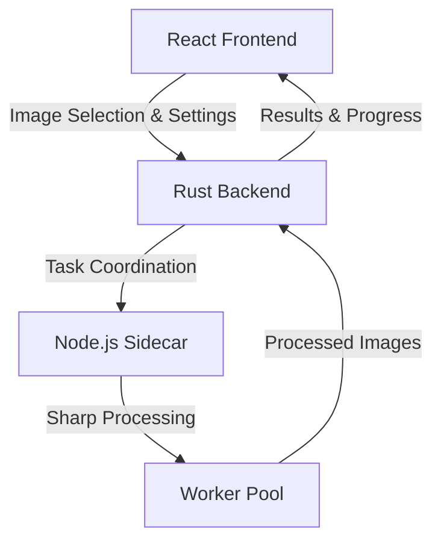
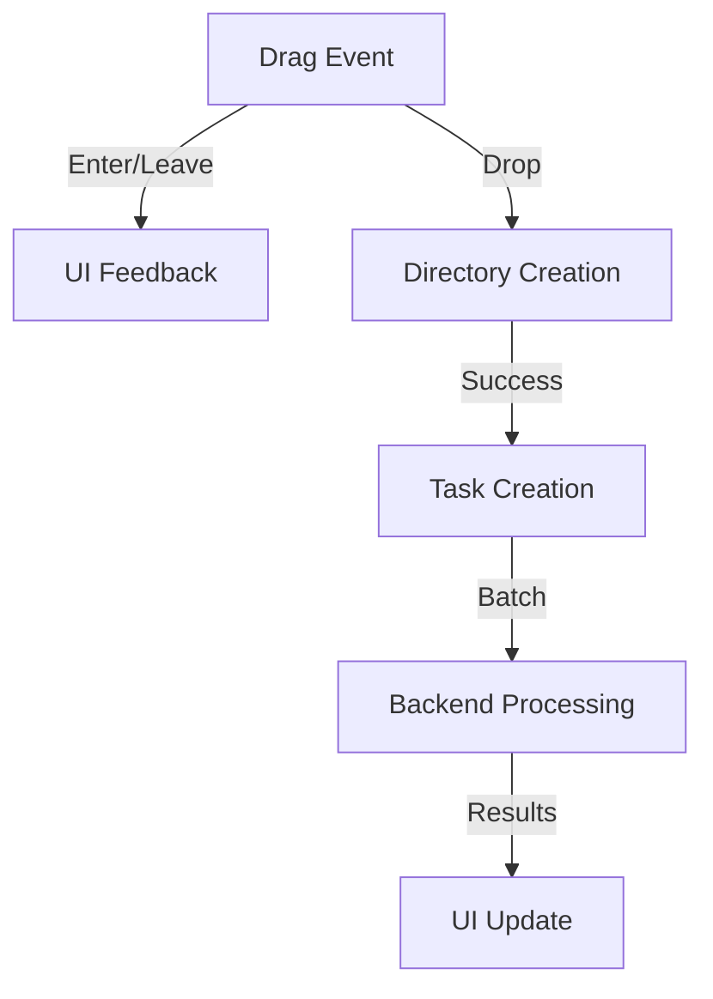
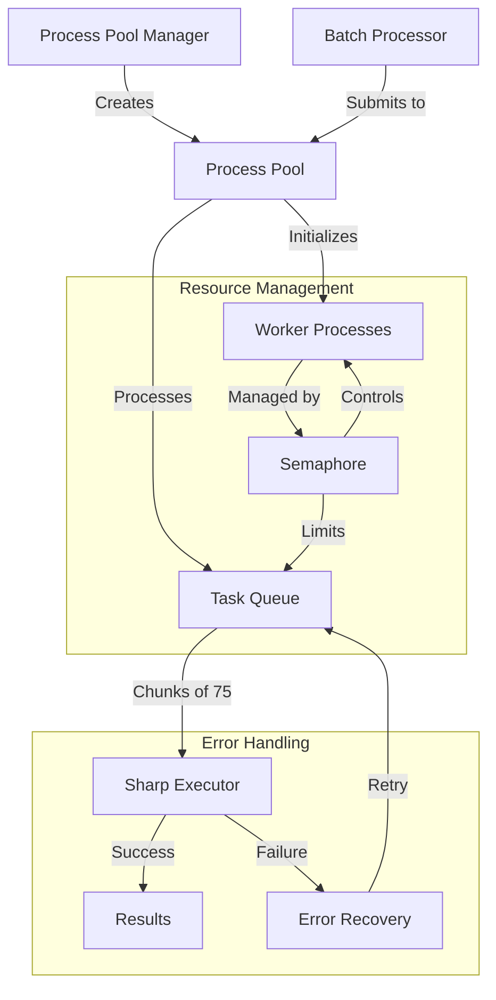
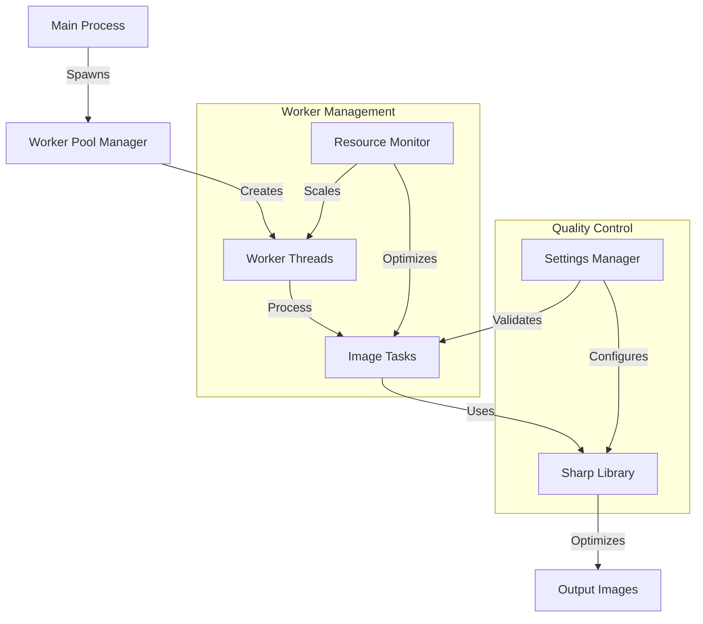
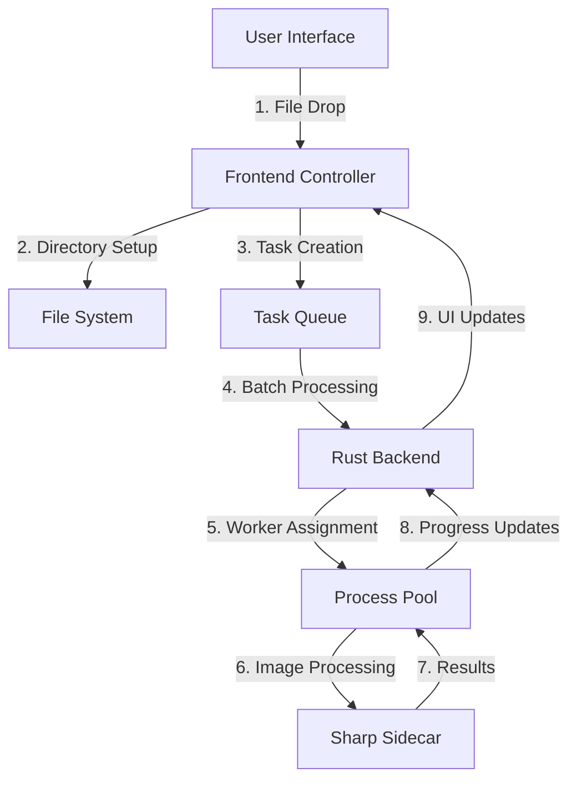

# Image Optimizer Documentation

## 1. System Architecture
### 1.1 Overview
The Image Optimizer is a high-performance desktop application built with Tauri, leveraging React for the frontend UI and Rust for the backend processing, with a Node.js sidecar service handling image optimization through the Sharp library. This architecture enables efficient handling of large image batches while maintaining a responsive interface, optimal resource utilization, and native performance across platforms.

Key Architectural Characteristics:
- **Distributed Processing**: Separates UI, coordination, and image processing concerns
- **Asynchronous Communication**: Event-driven architecture with non-blocking operations
- **Parallel Processing**: Multi-threaded image optimization with dynamic resource allocation
- **Memory Efficiency**: Stream-based processing to handle large image batches
- **Cross-Platform**: Platform-agnostic design with native performance



Technology Stack:
- Frontend: React with modern JavaScript
- Backend: Tauri/Rust for native performance
- Sidecar: Node.js with Sharp for image processing
- IPC: Tauri commands and binary protocols
- Storage: File system for image persistence


### 1.2 Core Components
#### 1.2.1 Frontend (React)
The frontend is built with React, focusing on simplicity and user experience. It features a drag-and-drop interface for image selection and a floating settings menu for optimization configuration.

Dependencies:
- `@tauri-apps/api`: Core Tauri integration for system operations
- `@tauri-apps/plugin-fs`: File system operations plugin
- `react`: UI framework and component management

Components Structure:
- **App** (App.jsx): Root component managing:
  - Drag and drop event handling
  - Image processing state
  - Results display
  - Settings coordination

- **FloatingMenu** (components/FloatingMenu.jsx):
  - Collapsible settings panel
  - Quality control (0-100%)
  - Resize options (width, height, edge-based)
  - Output format selection (JPEG, PNG, WebP, AVIF)

State Management:
```javascript
{
  settings: {
    quality: { global, jpeg, png, webp, avif },
    resize: { width, height, maintainAspect, mode, size },
    outputFormat: 'original' | 'jpeg' | 'png' | 'webp' | 'avif'
  },
  isProcessing: boolean,
  optimizationResults: Result[]
}
```

Event Flow:


Event Implementation:
- **File System Events**: 
  - `tauri://drag-drop`: Main entry point for image processing
  - `tauri://drag-enter/leave`: UI feedback during drag operations
  - Automatic directory creation for optimized images

- **Settings Events**:
  - Quality adjustments: Debounced handler for global and format-specific quality settings
  - Resize handling: Manages dimension changes with aspect ratio preservation
  - Format switching: Validates and updates output format with type safety

Tauri Integration:
```javascript
// Core system operations
await mkdir(optimizedPath, { recursive: true });
const results = await invoke('optimize_images', { tasks });
await listen("tauri://drag-drop", async (event) => {
  // Process dropped files
});
```

Styling System:
- **File Structure**:
  ```
  src/
  ├── styles/
  │   ├── components/
  │   │   ├── _dropzone.css     # Drag & drop area styles
  │   │   ├── _floating-menu.css # Settings menu styles
  │   │   └── _results.css      # Results grid styles
  │   ├── base/
  │   │   ├── _variables.css    # CSS variables & theming
  │   │   └── _animations.css   # Shared animations
  │   └── main.css              # Main stylesheet
  ```

- **Component-based CSS**:
  - BEM methodology for consistent class naming (e.g., `dropzone`, `dropzone--dragging`, `dropzone__content`)
  - Interactive elements with smooth transitions and animations
  - Responsive grid system for results display (auto-filling grid with flexible item sizing)

#### 1.2.2 Backend (Rust)
The backend is implemented in Rust using the Tauri framework, chosen for its memory safety, performance characteristics, and excellent concurrency support. It serves as a robust intermediary layer, coordinating image processing tasks between the React frontend and Node.js sidecar service while ensuring optimal resource utilization and system stability.

Core Components:
- **State Management** (`core/state.rs`):
  The application maintains thread-safe state through Rust's ownership system and Arc/Mutex patterns. It manages the process pool lifecycle, handles graceful shutdowns, and ensures clean resource cleanup during application termination.

  ```rust
  pub struct AppState {
      process_pool: Arc<Mutex<Option<ProcessPool>>>,
  }

  impl AppState {
      async fn get_or_init_process_pool(&self, app: tauri::AppHandle) -> Result<ProcessPool> {
          let mut pool = self.process_pool.lock().await;
          if pool.is_none() {
              let new_pool = ProcessPool::new(app);
              new_pool.warmup().await?;
              *pool = Some(new_pool);
          }
          Ok(pool.as_ref().unwrap().clone())
      }
  }
  ```

- **Task Management** (`core/types.rs`):
  ```rust
  // Core data structures for image processing
  struct ImageTask {
      input_path: String,
      output_path: String,
      settings: ImageSettings
  }

  struct OptimizationResult {
      original_path: String,
      optimized_path: String,
      original_size: u64,
      optimized_size: u64,
      success: bool,
      error: Option<String>,
      saved_bytes: i64,
      compression_ratio: f64
  }
  ```

Process Management:
The process management system is built around two key components: the Process Pool and Batch Processor. 



The Process Pool (`processing/pool/process_pool.rs`) implements an efficient resource management strategy:
```rust
impl ProcessPool {
    fn calculate_optimal_processes() -> usize {
        let cpu_count = num_cpus::get();
        ((cpu_count * 9) / 10).max(2)  // 90% CPU utilization
    }

    async fn process_batch(&self, tasks: Vec<ImageTask>) -> Result<Vec<OptimizationResult>> {
        let chunks = self.create_chunks(tasks);
        for chunk in chunks {
            let executor = SharpExecutor::new(self);
            executor.execute_batch(&chunk).await?;
        }
    }
}
```

Performance Features:
The backend implements several performance optimization strategies:

1. **Resource Optimization**
   The system automatically detects available CPU cores and maintains a pool of worker processes, optimizing resource utilization while preventing system overload. Process reuse and memory-aware batch sizing ensure efficient operation even under heavy loads.

2. **Error Handling and Recovery**
   ```rust
   pub enum OptimizerError {
       Processing(String),
       Sidecar(String),
       System(String)
   }

   impl BatchProcessor {
       async fn handle_failure(&self, error: OptimizerError, task: ImageTask) -> Result<()> {
           match error {
               OptimizerError::Sidecar(_) => self.restart_sidecar().await?,
               OptimizerError::Processing(_) => self.requeue_task(task).await?,
               OptimizerError::System(_) => return Err(error)
           }
           Ok(())
       }
   }
   ```

3. **Metrics and Monitoring**
   The backend maintains comprehensive performance metrics, tracking processing times, resource utilization, and optimization results. These metrics are used for performance optimization and user feedback.

Sidecar Integration:
The Sharp Executor (`processing/sharp/executor.rs`) manages communication with the Node.js sidecar through a well-defined command protocol:

1. **Command Structure**:
   - Batch-oriented operations for efficient processing
   - JSON-based task description and result reporting
   - Binary data handling for image processing
   - Structured error propagation

2. **Process Management**:
   - Health monitoring and automatic recovery
   - Resource cleanup on process termination
   - Efficient process pooling and reuse

Key Features:
- Asynchronous task processing with Tokio
- Thread-safe state management through Rust's ownership system
- Efficient resource utilization with dynamic scaling
- Comprehensive error handling with recovery strategies
- Detailed performance monitoring and metrics collection
- Graceful shutdown handling with resource cleanup

#### 1.2.3 Sidecar Service (Node.js/Sharp)
The sidecar service is implemented as a standalone Node.js application that handles image processing using the Sharp library. It's designed for high-performance, parallel image processing with comprehensive error handling and metrics collection.

##### Architecture Overview


##### Core Components

1. **Worker Pool Management**
The worker pool dynamically manages a collection of Sharp processing threads, scaling based on system resources. Each worker operates independently, processing its assigned batch of images while maintaining comprehensive metrics about its performance and resource utilization.

Key aspects of the pool management include:
- Dynamic scaling based on available CPU cores
- Resource monitoring and allocation
- Worker lifecycle management with graceful shutdown
- Comprehensive performance metrics collection

2. **Image Processing Engine**
The image processing engine leverages Sharp's capabilities while adding sophisticated optimization logic. It handles format conversion, resizing operations, and quality adjustments through a configurable pipeline.

The optimization process follows these steps:
1. Image metadata extraction and validation
2. Format-specific settings application
3. Resize operations (when specified)
4. Quality optimization
5. Output generation with compression

3. **Optimization Settings System**
The settings system provides three layers of optimization configuration:

Default Settings (Base Configuration):
```javascript
{
  jpeg: {
    quality: 90,
    mozjpeg: true,
    chromaSubsampling: '4:2:0'
  },
  webp: {
    quality: 90,
    effort: 4,
    lossless: false
  }
  // Additional formats...
}
```

Lossless Settings (Maximum Quality):
```javascript
{
  jpeg: {
    quality: 100,
    mozjpeg: true,
    chromaSubsampling: '4:4:4'
  },
  webp: {
    lossless: true,
    quality: 100,
    effort: 6
  }
  // Additional formats...
}
```

User Settings Override:
When users provide custom settings, they can override specific parameters while maintaining optimal defaults for others. The system intelligently merges these settings:
```javascript
userSettings = {
  quality: { global: 85, jpeg: 90 },
  resize: { mode: 'width', size: 1920 }
}
```

##### Batch Processing System

The batch processing system efficiently handles large volumes of images through:

1. **Intelligent Task Distribution**
The system determines optimal chunk sizes based on available resources and image characteristics. It distributes these chunks across the worker pool while maintaining balanced resource utilization.

2. **Coordinated Results Management**
Results from individual workers are collected and aggregated in a thread-safe manner, maintaining the original task order while providing real-time progress updates to the main application.

##### Performance Optimization

The sidecar implements several performance optimization strategies:

1. **Resource Management**
The service continuously monitors system resources, adjusting its processing strategy based on:
- Available CPU cores and memory
- Current system load
- Worker performance metrics
- Queue depth and processing rates

2. **Format-Specific Processing**
Each supported format (JPEG, PNG, WebP, AVIF, TIFF) receives specialized treatment with:
- Optimized compression parameters
- Format-specific quality controls
- Intelligent metadata handling
- Adaptive processing strategies

3. **Performance Monitoring**
The service maintains detailed metrics about:
```javascript
{
  worker_count: number,      // Active workers
  tasks_per_worker: number[], // Distribution of tasks
  queue_length: number,      // Pending tasks
  completed_tasks: number,   // Processed images
  duration_seconds: number   // Processing time
}
```

##### Error Handling and Recovery

The service implements a robust error handling system operating at multiple levels:

1. **Worker-Level Protection**
Workers are monitored for failures and resource issues. The system handles:
- Process crashes and hangs
- Memory limitations
- Processing timeouts
- Invalid input handling

2. **Task-Level Recovery**
Failed tasks are handled through a sophisticated recovery system that:
- Logs detailed error information
- Attempts recovery when appropriate
- Maintains system stability
- Reports issues to the main application

##### Integration Interface

The sidecar provides a clean integration interface through:

1. **Command Protocol**
A structured command system handles:
- Task submission and management
- Progress reporting
- Error propagation
- Resource coordination

2. **File System Management**
Robust file system operations ensure:
- Safe concurrent access
- Atomic write operations
- Proper cleanup procedures
- Path validation and security

## 2. Data Flow

The Image Optimizer implements a sophisticated multi-layered data flow architecture that coordinates communication between the frontend, backend, and sidecar components. This architecture ensures efficient image processing while maintaining system responsiveness and data integrity.

### 2.1 Image Processing Pipeline

The image processing pipeline orchestrates the flow of data from user input to optimized output through a series of coordinated stages:



The pipeline consists of three main stages:

1. **Input Processing**
The frontend captures user input through a drag-and-drop interface, automatically creating necessary directory structures and preparing optimization tasks. The system validates input files and generates appropriate output paths before submitting tasks to the backend.

2. **Task Management**
The backend coordinates task processing through a sophisticated queuing system. Each task undergoes validation and preprocessing before being organized into optimally-sized batches. The system assigns priorities based on task characteristics and current resource availability, ensuring efficient utilization of the processing pipeline.

3. **Result Management**
A dedicated result handling system maintains task order while providing real-time progress updates. The system efficiently manages memory usage through streaming processing and implements comprehensive error recovery mechanisms to handle failed operations.

### 2.2 Communication Protocols

The application employs three specialized communication channels, each optimized for its specific role:

1. **Frontend ↔ Backend Bridge**
Tauri's IPC system provides type-safe, bi-directional communication between the frontend and backend. This channel handles command invocation, event propagation, and progress updates through a structured protocol that ensures reliable data transfer and error handling.

```rust
#[tauri::command]
pub async fn optimize_images(
    app: tauri::AppHandle,
    state: State<'_, AppState>,
    tasks: Vec<BatchImageTask>
) -> OptimizerResult<Vec<OptimizationResult>> {
    state.get_or_init_process_pool(app).await?.process_batch(tasks).await
}
```

2. **Backend ↔ Sidecar Channel**
A robust process management system handles communication with the Sharp sidecar service. This channel implements resource-aware process pooling, health monitoring, and efficient binary data transfer protocols. The system automatically manages worker lifecycle and handles process recovery in case of failures.

3. **Event Distribution System**
An event-driven architecture maintains system responsiveness by efficiently distributing updates about processing progress, resource utilization, and system state changes. This system implements intelligent event batching and debouncing to prevent overwhelming any system component.

### 2.3 Data Validation and Error Handling

The system implements a comprehensive validation and error handling strategy operating at multiple levels:

```rust
#[derive(Error, Debug, Serialize)]
pub enum OptimizerError {
    #[error("Validation error: {0}")]
    Validation(#[from] ValidationError),
    #[error("Processing error: {0}")]
    Processing(String),
    #[error("Sidecar error: {0}")]
    Sidecar(String)
}
```

The validation system ensures data integrity through a multi-stage verification process. Input paths undergo validation for existence and accessibility, while settings are checked for compatibility and correctness. Resource availability is continuously monitored to prevent system overload.

Error recovery operates through a sophisticated multi-level system. Worker-level protection handles process failures and resource constraints, while task-level recovery manages individual processing errors. The system implements automatic retry mechanisms with exponential backoff for transient failures and provides graceful degradation for persistent issues.

Data consistency is maintained through atomic file operations and transaction-like task processing. The system ensures proper resource cleanup and state synchronization across all components, preventing resource leaks and maintaining system stability during both normal operation and error conditions.

## 3. Performance Optimization and Monitoring

The Image Optimizer implements a comprehensive benchmarking and monitoring system to track performance across all components.

### 3.1 Benchmarking System

The application uses a sophisticated benchmarking system that collects metrics at multiple levels:

1. **Time-based Metrics**
```rust
pub struct BenchmarkMetrics {
    pub total_duration: Duration,
    pub processing_times: Vec<Duration>,
    pub avg_processing_time: Duration,
}
```

2. **Worker Pool Metrics**
```rust
pub struct WorkerPoolMetrics {
    pub worker_count: usize,
    pub tasks_per_worker: Vec<usize>,
    pub active_workers: usize,
    pub queue_length: usize,
    pub completed_tasks: usize,
    pub total_tasks: usize,
    pub duration_seconds: f64,
}
```

3. **Optimization Metrics**
```rust
pub struct BenchmarkMetrics {
    pub compression_ratios: Vec<Percentage>,
    pub total_original_size: u64,
    pub total_optimized_size: u64,
}
```

4. **Batch Processing Metrics**
```rust
pub struct BenchmarkMetrics {
    pub total_batches: usize,
    pub batch_sizes: Vec<usize>,
    pub mode_batch_size: usize,
}
```

The benchmarking system provides:
- Detailed performance reports
- Task-level timing information
- Worker pool utilization stats
- Compression efficiency metrics
- Batch processing statistics

### 3.2 Resource Management

The application employs targeted resource management strategies:

1. **Process Pool Management**
- Dynamic worker allocation based on CPU cores
- Task distribution across workers
- Queue length monitoring
- Completion rate tracking

2. **Memory Management**
- Stream-based image processing
- Efficient buffer management
- Automatic garbage collection in Node.js sidecar

3. **I/O Optimization**
- Batched file system operations
- Efficient IPC protocols
- Optimized binary data transfer

### 3.3 Performance Reporting

The benchmark reporter provides comprehensive performance insights:

```rust
impl fmt::Display for BenchmarkReporter {
    fn fmt(&self, f: &mut fmt::Formatter<'_>) -> fmt::Result {
        // Time-based metrics
        - Total Duration
        - Average Processing Time per image

        // Worker pool metrics
        - Total Workers
        - Active Workers
        - Tasks Distribution
        - Queue Length
        - Completed Tasks
        - Processing Duration

        // Batch metrics
        - Total Batches
        - Mode Batch Size

        // Optimization metrics
        - Average Compression Ratio
        - Total Size Reduction
    }
}
```

This reporting system enables:
- Performance analysis
- Resource utilization tracking
- Optimization effectiveness measurement
- Processing efficiency monitoring

## 4. Build Process
### 4.1 Overview
The build process is designed to create a seamless, platform-specific executable that bundles all necessary components. It follows a carefully orchestrated sequence ensuring proper compilation and packaging of all components.

### 4.2 Development Build Flow
#### 4.2.1 Sharp Sidecar Build
1. Initial Build Preparation
   - Triggered by root package.json script:
     ```json
     "scripts": {
       "build:sharp": "cd sharp-sidecar && npm run build:rename",
       "tauri": "npm run build:sharp && tauri"
     }
     ```

2. Standalone Executable Compilation
   - Uses @yao-pkg/pkg for executable creation
   - Bundles Sharp library and dependencies
   - Assets include Sharp modules and optimization defaults

3. Platform-specific Binary Handling
   - Detects platform and adjusts binary naming (e.g., .exe for Windows)
   - Determines Rust target triple via `rustc -vV`
   - Places executable in Tauri's binary directory with platform-specific name

#### 4.2.2 Main Application Build
1. Tauri Configuration
   - Integrates sidecar executable:
     ```json
     "bundle": {
       "externalBin": [
         "binaries/sharp-sidecar"
       ]
     }
     ```

2. Build Modes
   - Development (`npm run tauri dev`):
     - Hot-reloading enabled
     - Debug logging and metrics
     - Development-specific optimizations
   
   - Benchmarking (`npm run tauri:benchmark`):
     - Performance metrics collection enabled
     - Optimization settings tuned for benchmarking
     - Additional logging for performance analysis

3. Final Assembly
   - Bundles React frontend, Rust backend, and Sharp sidecar
   - Creates platform-specific executable with all dependencies
   - Ensures correct binary permissions and locations