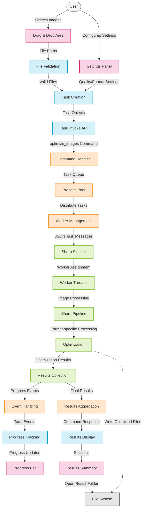

The optimization workflow follows these steps:
1. **Image Selection**: User selects images via drag-and-drop or file picker
2. **Task Creation**: Frontend creates optimization tasks with settings and sends them to the backend
3. **Task Processing**: Tasks are validated, batched, and distributed to Sharp workers
4. **Result Handling**: Optimization results return to the frontend with statistics and file paths

### 1.2 Frontend (React) 