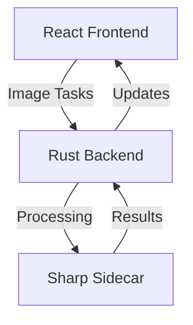

# Image Optimizer

A high-performance desktop application for batch optimizing images while maintaining quality. Built with Tauri, React, and Sharp, it provides an efficient and user-friendly solution for image optimization tasks.

This application is aimed at:
- 📸 Photographers optimizing large photo collections
- 🎨 Designers preparing images for web and mobile apps
- 🌐 Web developers reducing website load times
- 🖥️ Content creators managing media assets
- 📱 App developers optimizing application resources

The application automatically balances compression and quality, ensuring images stay perceptually lossless while significantly reducing file sizes.

## ✨ Features

- 🖼️ Modern drag-and-drop interface
- 📁 Efficient batch processing
- 🚀 Multi-threaded image optimization
- 💾 Smart output directory management
- 📊 Real-time optimization statistics
- 🎨 Native OS integration
- 🔒 Secure processing architecture

## 🛠️ Technology Stack

- **Frontend**: React 18 with modern JavaScript
- **Backend**: Rust with Tauri v2
- **Image Processing**: Sharp via Node.js sidecar
- **Build System**: Vite

## 🏗️ Architecture

The application uses a three-tier architecture:
- React frontend for user interface
- Rust/Tauri backend for system operations
- Node.js sidecar with Sharp for image processing



## 🚀 Getting Started

### Prerequisites

- Node.js v20 or later
- Rust (latest stable)
- [Tauri Prerequisites](https://v2.tauri.app/start/prerequisites/)

### Installation

1. Install dependencies:
```bash
# Frontend dependencies
npm install

# Sharp sidecar dependencies
cd sharp-sidecar
npm install
```

2. Development mode:
```bash
npm run tauri dev
```

3. Build for production:
```bash
npm run tauri build
```

4. Benchmark mode:
```bash
npm run tauri:benchmark
```
This mode enables performance metrics collection and detailed logging for optimization analysis.

## 📁 Project Structure

```
image-optimizer/
├── src/               # React frontend
├── src-tauri/         # Rust backend
├── sharp-sidecar/     # Image processing service
└── dist/              # Build output
```

## ⚡ Performance optimizations

- **Multi-threaded image processing**: Leverages all available CPU cores to process multiple images simultaneously, significantly reducing total processing time.

- **Efficient memory usage with stream processing**: Handles large images and batches without loading entire files into memory, preventing out-of-memory issues even with high-resolution images.

- **Optimized for large batch operations**: Smart batching system that automatically adjusts processing parameters based on file sizes and system resources.

- **Real-time progress tracking**: Provides detailed insights into optimization progress, including compression ratios, time estimates, and resource usage.

- **Automatic resource management**: Dynamically adjusts worker threads and memory allocation based on system load and available resources.
