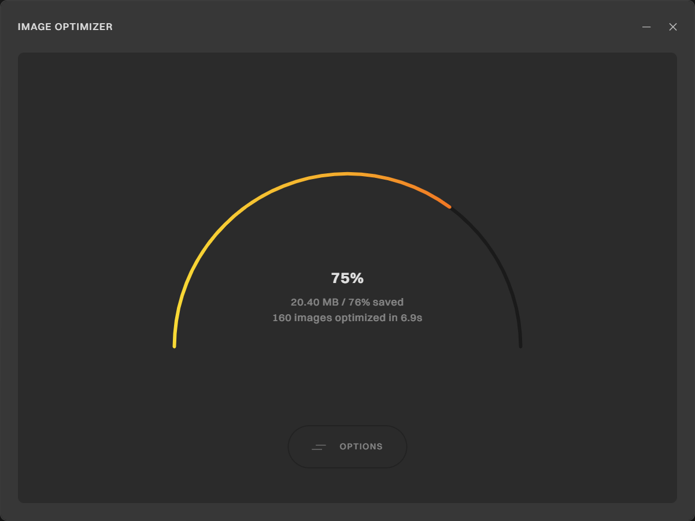

# Image Optimizer

 

Image Optimizer is a high-performance desktop application designed to streamline image compression and optimization without compromising visual quality. It offers advanced tools for rapid batch processing of images, including resizing, format conversion, and compression.

## Features

- **Visual Quality Preservation**: Optimizes file size while maintaining perceptual image quality
- **Format Conversion**: Seamlessly convert between image formats while maintaining visual quality
- **Intelligent Resizing**: Multiple resize modes including width, height, longest and shortest side and aspect ratio preservation
- **Quality Control**: Fine-tune compression levels with format-specific quality settings
- **Batch Processing**: Process multiple images in parallel for maximum efficiency
- **Cross-Platform**: Available for Windows and macOS

## Use Cases

- **Web Developers**: Reduce page load times by up to 80% with optimized images for better SEO rankings and user experience
- **Content Creators**: Maintain visual quality while reducing file sizes by 30-80% for faster social media uploads
- **Photographers**: Process entire photoshoots in minutes instead of hours while preserving professional quality
- **E-commerce Managers**: Create consistent product images with uniform dimensions and optimal file sizes
- **UI/UX Designers**: Export perfectly sized assets for applications with predictable file sizes
- **Digital Marketers**: Reduce email campaign load times and improve engagement with optimized images
- **Storage Optimization**: Reduce storage requirements for large image collections without sacrificing quality

## Technology Stack

- **Tauri**: Modern framework for building smaller, faster, and more secure desktop applications
- **React**: Component-based UI with hooks for state management
- **SCSS**: Modular styling system with variables
- **Rust**: High-performance, memory-safe language for the core application logic
- **Tokio**: Asynchronous runtime for non-blocking operations
- **Node.js**: Dedicated sidecar process for image processing operations
- **Sharp**: High-performance image processing library with libvips

## Documentation

For detailed technical information about the architecture, components, and implementation details, please refer to the [Technical Documentation](./DOCUMENTATION.md).

## Security

- **Unsigned Builds**: Currently, both Windows and macOS builds are not code-signed. This is on the roadmap but doesn't affect the application's security.

- **Security Warnings**: You may encounter security warnings when first running the application:
  - **Windows**: You might see a "Windows protected your PC" message. Click "More info" and then "Run anyway" to proceed.
  - **macOS**: You may need to right-click (or Control-click) the app and select "Open" from the context menu, then click "Open" in the dialog that appears.

- **No Network Requirements**: Image Optimizer processes all images locally without sending any data to external servers.

## Roadmap

- [ ] Add SVG support
- [ ] Add additional performance optimizations
- [ ] Add unsupported image format detection
- [x] Add macOS support
- [ ] Add updating mechanism
- [ ] Redesign the product website
- [ ] Design product logo & icons
- [ ] Implement code signing for Windows and macOS builds

## License
This project is licensed under the [Apache License 2.0](https://www.apache.org/licenses/LICENSE-2.0). Please review the license terms before using or distributing this software.
