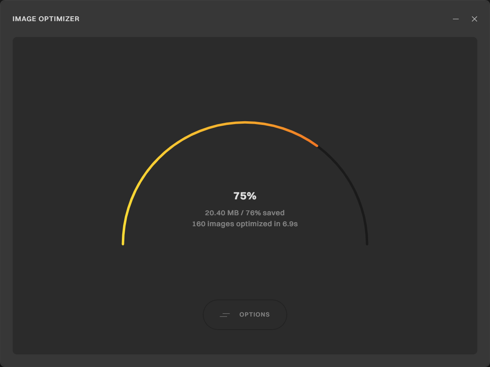

# Image Optimizer

 

Image Optimizer is a high-performance desktop application designed to streamline image compression and optimization without compromising visual quality. It offers advanced tools for rapid batch processing of images, including resizing, format conversion, and compression.

## Features

- **Visual Quality Preservation**: Optimizes file size while maintaining perceptual image quality
- **Format Conversion**: Seamlessly convert between image formats while maintaining visual quality
- **Intelligent Resizing**: Multiple resize modes including width, height, longest and shortest side and aspect ratio preservation
- **Quality Control**: Fine-tune compression levels with format-specific quality settings
- **Batch Processing**: Process multiple images in parallel for maximum efficiency
- **Cross-Platform**: Available for Windows, macOS and Linux

## Use Cases

- **Web Developers**: Reduce page load times by up to 80% with optimized images for better SEO rankings and user experience
- **Content Creators**: Maintain visual quality while reducing file sizes by 30-80% for faster social media uploads
- **Photographers**: Process entire photoshoots in minutes instead of hours while preserving professional quality
- **E-commerce Managers**: Create consistent product images with uniform dimensions and optimal file sizes
- **UI/UX Designers**: Export perfectly sized assets for applications with predictable file sizes
- **Digital Marketers**: Reduce email campaign load times and improve engagement with optimized images
- **Storage Optimization**: Reduce storage requirements for large image collections without sacrificing quality

## Technology Stack

- **Tauri**: Modern framework for building smaller, faster, and more secure desktop applications
- **React**: Component-based UI with hooks for state management
- **SCSS**: Modular styling system with variables
- **Rust**: High-performance, memory-safe language for the core application logic
- **Tokio**: Asynchronous runtime for non-blocking operations
- **libvips**: High-performance image processing via vendored native Rust bindings

## Documentation

For detailed technical information about the architecture, components, and implementation details, please refer to the [Architecture Documentation](./ARCHITECTURE.md).

## Security

- **Unsigned Builds**: Currently, both Windows and macOS builds are not code-signed. This is on the roadmap but doesn't affect the application's security.

- **Security Warnings**: You may encounter security warnings when first running the application:
  - **Windows**: You might see a "Windows protected your PC" message. Click "More info" and then "Run anyway" to proceed.
  - **macOS**: You may need to right-click (or Control-click) the app and select "Open" from the context menu, then click "Open" in the dialog that appears.

- **No Network Requirements**: Image Optimizer processes all images locally without sending any data to external servers.

## Roadmap

- [x] Add SVG support
- [ ] Add expert settings toggle
- [x] Add additional performance optimizations
- [x] Add unsupported image format detection
- [x] Add macOS support
- [x] Add Linux support
- [x] Add updating mechanism
- [ ] Redesign the product website
- [ ] Design product logo & icons
- [ ] Implement code signing for Windows and macOS builds
- [x] Add multi-language support

## License
This project is licensed under the [Apache License 2.0](https://www.apache.org/licenses/LICENSE-2.0). Please review the license terms before using or distributing this software.

-------------------------------------
Translated Report (Full Report Below)
-------------------------------------

Process:               image-optimizer [830]
Path:                  /Applications/Image Optimizer.app/Contents/MacOS/image-optimizer
Identifier:            com.image-optimizer.app
Version:               0.6.7 (0.6.7)
Code Type:             X86-64 (Native)
Parent Process:        launchd [1]
User ID:               501

Date/Time:             2026-04-15 11:28:59.9647 -0700
OS Version:            macOS 14.7 (23H124)
Report Version:        12
Anonymous UUID:        3A906CE9-59B3-4842-9BF4-C590152041E1

Time Awake Since Boot: 350 seconds

System Integrity Protection: enabled

Crashed Thread:        0

Exception Type:        EXC_CRASH (SIGABRT)
Exception Codes:       0x0000000000000000, 0x0000000000000000

Termination Reason:    Namespace DYLD, Code 1 Library missing
Library not loaded: /usr/local/opt/libraw/lib/libraw_r.25.dylib
Referenced from: <1D4C196B-2627-3B71-9183-CDBAB8DE5498> /Applications/Image Optimizer.app/Contents/Frameworks/libvips.dylib
Reason: tried: '/usr/local/opt/libraw/lib/libraw_r.25.dylib' (no such file), '/System/Volumes/Preboot/Cryptexes/OS/usr/local/opt/libraw/lib/libraw_r.25.dylib' (no such file), '/usr/local/opt/libraw/lib/libraw_r.25.dylib' (no such file)
(terminated at launch; ignore backtrace)

Thread 0 Crashed:
0   dyld                          	    0x7ff80c6d087a __abort_with_payload + 10
1   dyld                          	    0x7ff80c6e97f7 abort_with_payload_wrapper_internal + 82
2   dyld                          	    0x7ff80c6e9829 abort_with_payload + 9
3   dyld                          	    0x7ff80c6762b5 dyld4::halt(char const*, dyld4::StructuredError const*) + 335
4   dyld                          	    0x7ff80c6734bd dyld4::prepare(dyld4::APIs&, dyld3::MachOAnalyzer const*) + 4099
5   dyld                          	    0x7ff80c6722e4 start + 1812

Thread 0 crashed with X86 Thread State (64-bit):
  rax: 0x0000000002000209  rbx: 0x0000000000000001  rcx: 0x00007ff7b7129728  rdx: 0x00007ff7b7129b90
  rdi: 0x0000000000000006  rsi: 0x0000000000000001  rbp: 0x00007ff7b7129770  rsp: 0x00007ff7b7129728
   r8: 0x00007ff7b7129790   r9: 0x0000000000000000  r10: 0x0000000000000084  r11: 0x0000000000000246
  r12: 0x0000000000000000  r13: 0x00007ff7b7129b90  r14: 0x0000000000000006  r15: 0x0000000000000084
  rip: 0x00007ff80c6d087a  rfl: 0x0000000000000246  cr2: 0x0000000000000000
  
Logical CPU:     0
Error Code:      0x02000209 
Trap Number:     133

Binary Images:
       0x10a9d6000 -        0x10ab4bfff libvips.dylib (*) <1d4c196b-2627-3b71-9183-cdbab8de5498> /Applications/Image Optimizer.app/Contents/Frameworks/libvips.dylib
       0x10a401000 -        0x10a43afff libgobject-2.0.0.dylib (*) <dc313c03-7b6f-3562-9dc7-d0a187552869> /Applications/Image Optimizer.app/Contents/Frameworks/libgobject-2.0.0.dylib
       0x10a7b3000 -        0x10a8a7fff libglib-2.0.0.dylib (*) <ae1a0efe-3c30-3049-ac3b-3e347bf3f126> /Applications/Image Optimizer.app/Contents/Frameworks/libglib-2.0.0.dylib
       0x109f8b000 -        0x109fb3fff libintl.8.dylib (*) <58c8bdf7-78f4-39df-88b8-22a220223901> /Applications/Image Optimizer.app/Contents/Frameworks/libintl.8.dylib
       0x10a541000 -        0x10a662fff libgio-2.0.0.dylib (*) <706c1cfa-efba-3969-8bc5-38797fb9b2b7> /Applications/Image Optimizer.app/Contents/Frameworks/libgio-2.0.0.dylib
       0x109f3c000 -        0x109f3efff libgmodule-2.0.0.dylib (*) <574e5f2d-fd9a-35d0-99db-3173d564bb5e> /Applications/Image Optimizer.app/Contents/Frameworks/libgmodule-2.0.0.dylib
       0x10a451000 -        0x10a4dcfff libarchive.13.dylib (*) <defd2047-5fd2-377a-ad3f-b39c99a64d31> /Applications/Image Optimizer.app/Contents/Frameworks/libarchive.13.dylib
       0x10b169000 -        0x10b3e4fff libfftw3.3.dylib (*) <bd84d826-abf3-3461-a06a-1fbd56c6e9a3> /Applications/Image Optimizer.app/Contents/Frameworks/libfftw3.3.dylib
       0x10b428000 -        0x10b52dfff libcfitsio.10.dylib (*) <5b7e5877-6f3c-3e83-be2d-afd837f424a7> /Applications/Image Optimizer.app/Contents/Frameworks/libcfitsio.10.dylib
       0x10a6e3000 -        0x10a760fff libimagequant.0.4.dylib (*) <2f702376-234f-3698-909f-3c4e982279c5> /Applications/Image Optimizer.app/Contents/Frameworks/libimagequant.0.4.dylib
       0x109f37000 -        0x109f39fff libcgif.0.dylib (*) <43b24483-f48e-3bd3-9796-abc78890bdd7> /Applications/Image Optimizer.app/Contents/Frameworks/libcgif.0.dylib
       0x109f42000 -        0x109f60fff libexif.12.dylib (*) <cd244a85-e309-3db7-a958-028432d2fcd9> /Applications/Image Optimizer.app/Contents/Frameworks/libexif.12.dylib
       0x10a8d2000 -        0x10a96dfff libjpeg.62.dylib (*) <5e938e02-ae79-36fb-ac5c-e37db9f52018> /Applications/Image Optimizer.app/Contents/Frameworks/libjpeg.62.dylib
       0x10af0c000 -        0x10af53fff libuhdr.1.dylib (*) <626392c3-d0a6-3c1c-b6ad-686c19674683> /Applications/Image Optimizer.app/Contents/Frameworks/libuhdr.1.dylib
       0x109fbb000 -        0x109fddfff libpng16.16.dylib (*) <759c138a-db79-3643-a538-28c3c351d25a> /Applications/Image Optimizer.app/Contents/Frameworks/libpng16.16.dylib
       0x10af8a000 -        0x10afe0fff libwebp.7.dylib (*) <5c22faf4-85f0-3111-aff7-9633b6b8a80c> /Applications/Image Optimizer.app/Contents/Frameworks/libwebp.7.dylib
       0x109f22000 -        0x109f28fff libwebpmux.3.dylib (*) <eecd1202-bd79-31d1-9fa8-66f68eea3f7d> /Applications/Image Optimizer.app/Contents/Frameworks/libwebpmux.3.dylib
       0x109f2c000 -        0x109f2efff libwebpdemux.2.dylib (*) <a66ed362-bf37-370c-89e1-3acfedc8fa8e> /Applications/Image Optimizer.app/Contents/Frameworks/libwebpdemux.2.dylib
       0x109fe6000 -        0x109ff3fff libpangocairo-1.0.0.dylib (*) <8fc5e77f-8863-332e-8564-7af599b9d463> /Applications/Image Optimizer.app/Contents/Frameworks/libpangocairo-1.0.0.dylib
       0x10aff0000 -        0x10b032fff libpango-1.0.0.dylib (*) <ec1bae92-b548-37f0-abbf-3466335148d1> /Applications/Image Optimizer.app/Contents/Frameworks/libpango-1.0.0.dylib
       0x10b04b000 -        0x10b127fff libcairo.2.dylib (*) <c7b32cff-d4e8-3c9a-bef8-844a33d60260> /Applications/Image Optimizer.app/Contents/Frameworks/libcairo.2.dylib
       0x10a789000 -        0x10a795fff libpangoft2-1.0.0.dylib (*) <a5f70f7b-d296-3bff-8bff-f7786dbca11a> /Applications/Image Optimizer.app/Contents/Frameworks/libpangoft2-1.0.0.dylib
       0x10a98a000 -        0x10a9bdfff libfontconfig.1.dylib (*) <9ab8e544-b2c6-39c2-8418-07e4fbf14e1f> /Applications/Image Optimizer.app/Contents/Frameworks/libfontconfig.1.dylib
       0x10b6d8000 -        0x10b743fff libtiff.6.dylib (*) <6cb917a4-4b66-385f-89f7-0a7ef99a72b0> /Applications/Image Optimizer.app/Contents/Frameworks/libtiff.6.dylib
       0x10c258000 -        0x10c65efff librsvg-2.2.dylib (*) <b880b47d-4ae7-30f2-b700-8f846bca38aa> /Applications/Image Optimizer.app/Contents/Frameworks/librsvg-2.2.dylib
       0x10b759000 -        0x10b7b2fff libmatio.14.dylib (*) <c6d27b28-1399-381d-b15f-6c0271aa79c8> /Applications/Image Optimizer.app/Contents/Frameworks/libmatio.14.dylib
       0x10aeaf000 -        0x10aeedfff liblcms2.2.dylib (*) <960d84c3-88b6-3ea1-98ad-db8db364a30a> /Applications/Image Optimizer.app/Contents/Frameworks/liblcms2.2.dylib
       0x10b9b0000 -        0x10ba2cfff libOpenEXR-3_4.33.dylib (*) <25249caf-8d7c-3e35-b694-2b10aa30a914> /Applications/Image Optimizer.app/Contents/Frameworks/libOpenEXR-3_4.33.dylib
       0x10adff000 -        0x10ae89fff libpcre2-8.0.dylib (*) <b45a75e7-c2d9-3f43-ac25-a4ee50020a1f> /Applications/Image Optimizer.app/Contents/Frameworks/libpcre2-8.0.dylib
       0x108dd4000 -        0x109e53fff com.image-optimizer.app (0.6.7) <c93903e3-3297-3197-8d53-99734c50e03f> /Applications/Image Optimizer.app/Contents/MacOS/image-optimizer
    0x7ff80c66c000 -     0x7ff80c6fc81f dyld (*) <3a3cc221-017e-30a8-a2d3-0db1b0e5d805> /usr/lib/dyld
               0x0 - 0xffffffffffffffff ??? (*) <00000000-0000-0000-0000-000000000000> ???

External Modification Summary:
  Calls made by other processes targeting this process:
    task_for_pid: 0
    thread_create: 0
    thread_set_state: 0
  Calls made by this process:
    task_for_pid: 0
    thread_create: 0
    thread_set_state: 0
  Calls made by all processes on this machine:
    task_for_pid: 0
    thread_create: 0
    thread_set_state: 0

VM Region Summary:
ReadOnly portion of Libraries: Total=698.3M resident=0K(0%) swapped_out_or_unallocated=698.3M(100%)
Writable regions: Total=15.7M written=0K(0%) resident=0K(0%) swapped_out=0K(0%) unallocated=15.7M(100%)

                                VIRTUAL   REGION 
REGION TYPE                        SIZE    COUNT (non-coalesced) 
===========                     =======  ======= 
STACK GUARD                       56.0M        1 
Stack                             8192K        1 
VM_ALLOCATE                       4356K        3 
__CTF                               824        1 
__DATA                            29.0M      429 
__DATA_CONST                      24.4M      277 
__DATA_DIRTY                       876K      129 
__FONT_DATA                        2352        1 
__LINKEDIT                       184.4M       31 
__OBJC_RO                         71.9M        1 
__OBJC_RW                         2201K        2 
__TEXT                           513.9M      448 
shared memory                        8K        2 
===========                     =======  ======= 
TOTAL                            894.8M     1326 

-----------
Full Report
-----------

{"app_name":"image-optimizer","timestamp":"2026-04-15 11:29:05.00 -0700","app_version":"0.6.7","slice_uuid":"c93903e3-3297-3197-8d53-99734c50e03f","build_version":"0.6.7","platform":1,"bundleID":"com.image-optimizer.app","share_with_app_devs":0,"is_first_party":0,"bug_type":"309","os_version":"macOS 14.7 (23H124)","roots_installed":0,"name":"image-optimizer","incident_id":"C7E12B17-BB80-4DE0-9B25-036F3D4BE73C"}
{
  "uptime" : 350,
  "procRole" : "Background",
  "version" : 2,
  "userID" : 501,
  "deployVersion" : 210,
  "modelCode" : "MacBookPro19,1",
  "coalitionID" : 1023,
  "osVersion" : {
    "train" : "macOS 14.7",
    "build" : "23H124",
    "releaseType" : "User"
  },
  "captureTime" : "2026-04-15 11:28:59.9647 -0700",
  "codeSigningMonitor" : 0,
  "incident" : "C7E12B17-BB80-4DE0-9B25-036F3D4BE73C",
  "pid" : 830,
  "cpuType" : "X86-64",
  "roots_installed" : 0,
  "bug_type" : "309",
  "procLaunch" : "2026-04-15 11:28:57.5323 -0700",
  "procStartAbsTime" : 351523860668,
  "procExitAbsTime" : 353955851857,
  "procName" : "image-optimizer",
  "procPath" : "\/Applications\/Image Optimizer.app\/Contents\/MacOS\/image-optimizer",
  "bundleInfo" : {"CFBundleShortVersionString":"0.6.7","CFBundleVersion":"0.6.7","CFBundleIdentifier":"com.image-optimizer.app"},
  "storeInfo" : {"deviceIdentifierForVendor":"2318F6D0-120E-55A8-A18B-74F141D49B33","thirdParty":true},
  "parentProc" : "launchd",
  "parentPid" : 1,
  "coalitionName" : "com.image-optimizer.app",
  "crashReporterKey" : "3A906CE9-59B3-4842-9BF4-C590152041E1",
  "codeSigningID" : "",
  "codeSigningTeamID" : "",
  "codeSigningValidationCategory" : 0,
  "codeSigningTrustLevel" : 4294967295,
  "sip" : "enabled",
  "exception" : {"codes":"0x0000000000000000, 0x0000000000000000","rawCodes":[0,0],"type":"EXC_CRASH","signal":"SIGABRT"},
  "termination" : {"code":1,"flags":518,"namespace":"DYLD","indicator":"Library missing","details":["(terminated at launch; ignore backtrace)"],"reasons":["Library not loaded: \/usr\/local\/opt\/libraw\/lib\/libraw_r.25.dylib","Referenced from: <1D4C196B-2627-3B71-9183-CDBAB8DE5498> \/Applications\/Image Optimizer.app\/Contents\/Frameworks\/libvips.dylib","Reason: tried: '\/usr\/local\/opt\/libraw\/lib\/libraw_r.25.dylib' (no such file), '\/System\/Volumes\/Preboot\/Cryptexes\/OS\/usr\/local\/opt\/libraw\/lib\/libraw_r.25.dylib' (no such file), '\/usr\/local\/opt\/libraw\/lib\/libraw_r.25.dylib' (no such file)"]},
  "extMods" : {"caller":{"thread_create":0,"thread_set_state":0,"task_for_pid":0},"system":{"thread_create":0,"thread_set_state":0,"task_for_pid":0},"targeted":{"thread_create":0,"thread_set_state":0,"task_for_pid":0},"warnings":0},
  "faultingThread" : 0,
  "threads" : [{"triggered":true,"id":10588,"threadState":{"r13":{"value":140701905099664},"rax":{"value":33554953},"rflags":{"value":582},"cpu":{"value":0},"r14":{"value":6},"rsi":{"value":1},"r8":{"value":140701905098640},"cr2":{"value":0},"rdx":{"value":140701905099664},"r10":{"value":132},"r9":{"value":0},"r15":{"value":132},"rbx":{"value":1},"trap":{"value":133},"err":{"value":33554953},"r11":{"value":582},"rip":{"value":140703337089146,"matchesCrashFrame":1},"rbp":{"value":140701905098608},"rsp":{"value":140701905098536},"r12":{"value":0},"rcx":{"value":140701905098536},"flavor":"x86_THREAD_STATE","rdi":{"value":6}},"frames":[{"imageOffset":411770,"symbol":"__abort_with_payload","symbolLocation":10,"imageIndex":30},{"imageOffset":514039,"symbol":"abort_with_payload_wrapper_internal","symbolLocation":82,"imageIndex":30},{"imageOffset":514089,"symbol":"abort_with_payload","symbolLocation":9,"imageIndex":30},{"imageOffset":41653,"symbol":"dyld4::halt(char const*, dyld4::StructuredError const*)","symbolLocation":335,"imageIndex":30},{"imageOffset":29885,"symbol":"dyld4::prepare(dyld4::APIs&, dyld3::MachOAnalyzer const*)","symbolLocation":4099,"imageIndex":30},{"imageOffset":25316,"symbol":"start","symbolLocation":1812,"imageIndex":30}]}],
  "usedImages" : [
  {
    "source" : "P",
    "arch" : "x86_64",
    "base" : 4473053184,
    "size" : 1531904,
    "uuid" : "1d4c196b-2627-3b71-9183-cdbab8de5498",
    "path" : "\/Applications\/Image Optimizer.app\/Contents\/Frameworks\/libvips.dylib",
    "name" : "libvips.dylib"
  },
  {
    "source" : "P",
    "arch" : "x86_64",
    "base" : 4466937856,
    "size" : 237568,
    "uuid" : "dc313c03-7b6f-3562-9dc7-d0a187552869",
    "path" : "\/Applications\/Image Optimizer.app\/Contents\/Frameworks\/libgobject-2.0.0.dylib",
    "name" : "libgobject-2.0.0.dylib"
  },
  {
    "source" : "P",
    "arch" : "x86_64",
    "base" : 4470812672,
    "size" : 1003520,
    "uuid" : "ae1a0efe-3c30-3049-ac3b-3e347bf3f126",
    "path" : "\/Applications\/Image Optimizer.app\/Contents\/Frameworks\/libglib-2.0.0.dylib",
    "name" : "libglib-2.0.0.dylib"
  },
  {
    "source" : "P",
    "arch" : "x86_64",
    "base" : 4462260224,
    "size" : 167936,
    "uuid" : "58c8bdf7-78f4-39df-88b8-22a220223901",
    "path" : "\/Applications\/Image Optimizer.app\/Contents\/Frameworks\/libintl.8.dylib",
    "name" : "libintl.8.dylib"
  },
  {
    "source" : "P",
    "arch" : "x86_64",
    "base" : 4468248576,
    "size" : 1187840,
    "uuid" : "706c1cfa-efba-3969-8bc5-38797fb9b2b7",
    "path" : "\/Applications\/Image Optimizer.app\/Contents\/Frameworks\/libgio-2.0.0.dylib",
    "name" : "libgio-2.0.0.dylib"
  },
  {
    "source" : "P",
    "arch" : "x86_64",
    "base" : 4461936640,
    "size" : 12288,
    "uuid" : "574e5f2d-fd9a-35d0-99db-3173d564bb5e",
    "path" : "\/Applications\/Image Optimizer.app\/Contents\/Frameworks\/libgmodule-2.0.0.dylib",
    "name" : "libgmodule-2.0.0.dylib"
  },
  {
    "source" : "P",
    "arch" : "x86_64",
    "base" : 4467265536,
    "size" : 573440,
    "uuid" : "defd2047-5fd2-377a-ad3f-b39c99a64d31",
    "path" : "\/Applications\/Image Optimizer.app\/Contents\/Frameworks\/libarchive.13.dylib",
    "name" : "libarchive.13.dylib"
  },
  {
    "source" : "P",
    "arch" : "x86_64",
    "base" : 4480995328,
    "size" : 2605056,
    "uuid" : "bd84d826-abf3-3461-a06a-1fbd56c6e9a3",
    "path" : "\/Applications\/Image Optimizer.app\/Contents\/Frameworks\/libfftw3.3.dylib",
    "name" : "libfftw3.3.dylib"
  },
  {
    "source" : "P",
    "arch" : "x86_64",
    "base" : 4483874816,
    "size" : 1073152,
    "uuid" : "5b7e5877-6f3c-3e83-be2d-afd837f424a7",
    "path" : "\/Applications\/Image Optimizer.app\/Contents\/Frameworks\/libcfitsio.10.dylib",
    "name" : "libcfitsio.10.dylib"
  },
  {
    "source" : "P",
    "arch" : "x86_64",
    "base" : 4469960704,
    "size" : 516096,
    "uuid" : "2f702376-234f-3698-909f-3c4e982279c5",
    "path" : "\/Applications\/Image Optimizer.app\/Contents\/Frameworks\/libimagequant.0.4.dylib",
    "name" : "libimagequant.0.4.dylib"
  },
  {
    "source" : "P",
    "arch" : "x86_64",
    "base" : 4461916160,
    "size" : 12288,
    "uuid" : "43b24483-f48e-3bd3-9796-abc78890bdd7",
    "path" : "\/Applications\/Image Optimizer.app\/Contents\/Frameworks\/libcgif.0.dylib",
    "name" : "libcgif.0.dylib"
  },
  {
    "source" : "P",
    "arch" : "x86_64",
    "base" : 4461961216,
    "size" : 126976,
    "uuid" : "cd244a85-e309-3db7-a958-028432d2fcd9",
    "path" : "\/Applications\/Image Optimizer.app\/Contents\/Frameworks\/libexif.12.dylib",
    "name" : "libexif.12.dylib"
  },
  {
    "source" : "P",
    "arch" : "x86_64",
    "base" : 4471988224,
    "size" : 638976,
    "uuid" : "5e938e02-ae79-36fb-ac5c-e37db9f52018",
    "path" : "\/Applications\/Image Optimizer.app\/Contents\/Frameworks\/libjpeg.62.dylib",
    "name" : "libjpeg.62.dylib"
  },
  {
    "source" : "P",
    "arch" : "x86_64",
    "base" : 4478517248,
    "size" : 294912,
    "uuid" : "626392c3-d0a6-3c1c-b6ad-686c19674683",
    "path" : "\/Applications\/Image Optimizer.app\/Contents\/Frameworks\/libuhdr.1.dylib",
    "name" : "libuhdr.1.dylib"
  },
  {
    "source" : "P",
    "arch" : "x86_64",
    "base" : 4462456832,
    "size" : 143360,
    "uuid" : "759c138a-db79-3643-a538-28c3c351d25a",
    "path" : "\/Applications\/Image Optimizer.app\/Contents\/Frameworks\/libpng16.16.dylib",
    "name" : "libpng16.16.dylib"
  },
  {
    "source" : "P",
    "arch" : "x86_64",
    "base" : 4479033344,
    "size" : 356352,
    "uuid" : "5c22faf4-85f0-3111-aff7-9633b6b8a80c",
    "path" : "\/Applications\/Image Optimizer.app\/Contents\/Frameworks\/libwebp.7.dylib",
    "name" : "libwebp.7.dylib"
  },
  {
    "source" : "P",
    "arch" : "x86_64",
    "base" : 4461830144,
    "size" : 28672,
    "uuid" : "eecd1202-bd79-31d1-9fa8-66f68eea3f7d",
    "path" : "\/Applications\/Image Optimizer.app\/Contents\/Frameworks\/libwebpmux.3.dylib",
    "name" : "libwebpmux.3.dylib"
  },
  {
    "source" : "P",
    "arch" : "x86_64",
    "base" : 4461871104,
    "size" : 12288,
    "uuid" : "a66ed362-bf37-370c-89e1-3acfedc8fa8e",
    "path" : "\/Applications\/Image Optimizer.app\/Contents\/Frameworks\/libwebpdemux.2.dylib",
    "name" : "libwebpdemux.2.dylib"
  },
  {
    "source" : "P",
    "arch" : "x86_64",
    "base" : 4462632960,
    "size" : 57344,
    "uuid" : "8fc5e77f-8863-332e-8564-7af599b9d463",
    "path" : "\/Applications\/Image Optimizer.app\/Contents\/Frameworks\/libpangocairo-1.0.0.dylib",
    "name" : "libpangocairo-1.0.0.dylib"
  },
  {
    "source" : "P",
    "arch" : "x86_64",
    "base" : 4479451136,
    "size" : 274432,
    "uuid" : "ec1bae92-b548-37f0-abbf-3466335148d1",
    "path" : "\/Applications\/Image Optimizer.app\/Contents\/Frameworks\/libpango-1.0.0.dylib",
    "name" : "libpango-1.0.0.dylib"
  },
  {
    "source" : "P",
    "arch" : "x86_64",
    "base" : 4479823872,
    "size" : 905216,
    "uuid" : "c7b32cff-d4e8-3c9a-bef8-844a33d60260",
    "path" : "\/Applications\/Image Optimizer.app\/Contents\/Frameworks\/libcairo.2.dylib",
    "name" : "libcairo.2.dylib"
  },
  {
    "source" : "P",
    "arch" : "x86_64",
    "base" : 4470640640,
    "size" : 53248,
    "uuid" : "a5f70f7b-d296-3bff-8bff-f7786dbca11a",
    "path" : "\/Applications\/Image Optimizer.app\/Contents\/Frameworks\/libpangoft2-1.0.0.dylib",
    "name" : "libpangoft2-1.0.0.dylib"
  },
  {
    "source" : "P",
    "arch" : "x86_64",
    "base" : 4472741888,
    "size" : 212992,
    "uuid" : "9ab8e544-b2c6-39c2-8418-07e4fbf14e1f",
    "path" : "\/Applications\/Image Optimizer.app\/Contents\/Frameworks\/libfontconfig.1.dylib",
    "name" : "libfontconfig.1.dylib"
  },
  {
    "source" : "P",
    "arch" : "x86_64",
    "base" : 4486692864,
    "size" : 442368,
    "uuid" : "6cb917a4-4b66-385f-89f7-0a7ef99a72b0",
    "path" : "\/Applications\/Image Optimizer.app\/Contents\/Frameworks\/libtiff.6.dylib",
    "name" : "libtiff.6.dylib"
  },
  {
    "source" : "P",
    "arch" : "x86_64",
    "base" : 4498751488,
    "size" : 4222976,
    "uuid" : "b880b47d-4ae7-30f2-b700-8f846bca38aa",
    "path" : "\/Applications\/Image Optimizer.app\/Contents\/Frameworks\/librsvg-2.2.dylib",
    "name" : "librsvg-2.2.dylib"
  },
  {
    "source" : "P",
    "arch" : "x86_64",
    "base" : 4487221248,
    "size" : 368640,
    "uuid" : "c6d27b28-1399-381d-b15f-6c0271aa79c8",
    "path" : "\/Applications\/Image Optimizer.app\/Contents\/Frameworks\/libmatio.14.dylib",
    "name" : "libmatio.14.dylib"
  },
  {
    "source" : "P",
    "arch" : "x86_64",
    "base" : 4478136320,
    "size" : 258048,
    "uuid" : "960d84c3-88b6-3ea1-98ad-db8db364a30a",
    "path" : "\/Applications\/Image Optimizer.app\/Contents\/Frameworks\/liblcms2.2.dylib",
    "name" : "liblcms2.2.dylib"
  },
  {
    "source" : "P",
    "arch" : "x86_64",
    "base" : 4489674752,
    "size" : 512000,
    "uuid" : "25249caf-8d7c-3e35-b694-2b10aa30a914",
    "path" : "\/Applications\/Image Optimizer.app\/Contents\/Frameworks\/libOpenEXR-3_4.33.dylib",
    "name" : "libOpenEXR-3_4.33.dylib"
  },
  {
    "source" : "P",
    "arch" : "x86_64",
    "base" : 4477415424,
    "size" : 569344,
    "uuid" : "b45a75e7-c2d9-3f43-ac25-a4ee50020a1f",
    "path" : "\/Applications\/Image Optimizer.app\/Contents\/Frameworks\/libpcre2-8.0.dylib",
    "name" : "libpcre2-8.0.dylib"
  },
  {
    "source" : "P",
    "arch" : "x86_64",
    "base" : 4443684864,
    "CFBundleShortVersionString" : "0.6.7",
    "CFBundleIdentifier" : "com.image-optimizer.app",
    "size" : 17301504,
    "uuid" : "c93903e3-3297-3197-8d53-99734c50e03f",
    "path" : "\/Applications\/Image Optimizer.app\/Contents\/MacOS\/image-optimizer",
    "name" : "image-optimizer",
    "CFBundleVersion" : "0.6.7"
  },
  {
    "source" : "P",
    "arch" : "x86_64",
    "base" : 140703336677376,
    "size" : 591904,
    "uuid" : "3a3cc221-017e-30a8-a2d3-0db1b0e5d805",
    "path" : "\/usr\/lib\/dyld",
    "name" : "dyld"
  },
  {
    "size" : 0,
    "source" : "A",
    "base" : 0,
    "uuid" : "00000000-0000-0000-0000-000000000000"
  }
],
  "sharedCache" : {
  "base" : 140703335981056,
  "size" : 25769803776,
  "uuid" : "0558adbc-51e6-35a7-9a10-a10a1291df47"
},
  "vmSummary" : "ReadOnly portion of Libraries: Total=698.3M resident=0K(0%) swapped_out_or_unallocated=698.3M(100%)\nWritable regions: Total=15.7M written=0K(0%) resident=0K(0%) swapped_out=0K(0%) unallocated=15.7M(100%)\n\n                                VIRTUAL   REGION \nREGION TYPE                        SIZE    COUNT (non-coalesced) \n===========                     =======  ======= \nSTACK GUARD                       56.0M        1 \nStack                             8192K        1 \nVM_ALLOCATE                       4356K        3 \n__CTF                               824        1 \n__DATA                            29.0M      429 \n__DATA_CONST                      24.4M      277 \n__DATA_DIRTY                       876K      129 \n__FONT_DATA                        2352        1 \n__LINKEDIT                       184.4M       31 \n__OBJC_RO                         71.9M        1 \n__OBJC_RW                         2201K        2 \n__TEXT                           513.9M      448 \nshared memory                        8K        2 \n===========                     =======  ======= \nTOTAL                            894.8M     1326 \n",
  "legacyInfo" : {
  "threadTriggered" : {

  }
},
  "logWritingSignature" : "ee1ec1e9b60dc8e456596593cadadd55556010a1",
  "trialInfo" : {
  "rollouts" : [
    {
      "rolloutId" : "645197bf528fbf3c3af54105",
      "factorPackIds" : {
        "SIRI_VALUE_INFERENCE_PERVASIVE_ENTITY_RESOLUTION" : "663e65b4a1526e1ca0e288a1"
      },
      "deploymentId" : 240000002
    },
    {
      "rolloutId" : "60f8ddccefea4203d95cbeef",
      "factorPackIds" : {

      },
      "deploymentId" : 240000025
    }
  ],
  "experiments" : [

  ]
}
}

Model: MacBookPro19,1, BootROM VMW201.00V.24866131.B64.2507211911, 8 processors, Unknown, 2,57 GHz, 8 GB, SMC 2.8f0
Graphics: Display, 3 MB
Display: Unknown Display, 1024 x 768 (XGA - eXtended Graphics Array), Main, MirrorOff, Online
Memory Module: RAM slot #0/RAM slot #0, 8 GB, DRAM, 4800 MHz, VMware Virtual RAM, VMW-8192MB
Bluetooth: Version (null), 0 services, 0 devices, 0 incoming serial ports
Network Service: Ethernet, Ethernet, en0
PCI Card: sppci_expresscard_name, Ethernet Controller
PCI Card: sppci_expresscard_name, USB eXtensible Host Controller
Serial ATA Device: VMware Virtual SATA Hard Drive, 85,9 GB
Serial ATA Device: VMware Virtual SATA CDRW Drive, 16,64 GB
USB Device: USB20Bus
USB Device: USB32Bus
USB Device: VMware Virtual USB Hub
USB Device: VMware Virtual USB Hub
USB Device: VMware Virtual USB Keyboard
USB Device: VMware Virtual USB Mouse
Thunderbolt Bus: 
