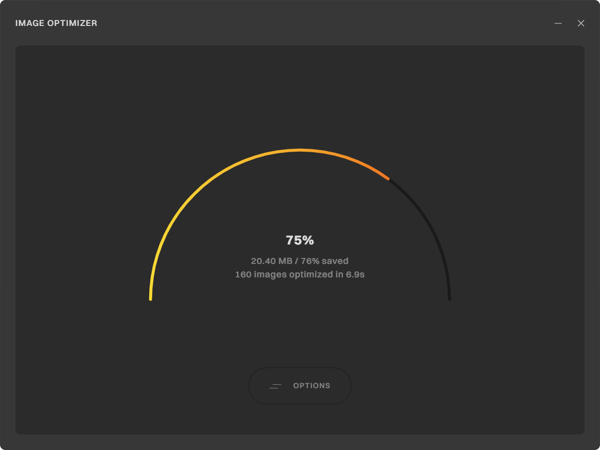

# Image Optimizer

 

Image Optimizer is a high-performance desktop application designed to streamline image compression and optimization without compromising visual quality. It offers advanced tools for rapid batch processing of images, including resizing, format conversion, and compression.

## Features

- **Visual Quality Preservation**: Optimizes file size while maintaining perceptual image quality
- **Format Conversion**: Seamlessly convert between image formats while maintaining visual quality
- **Intelligent Resizing**: Multiple resize modes including width, height, longest and shortest side and aspect ratio preservation
- **Quality Control**: Fine-tune compression levels with format-specific quality settings
- **Batch Processing**: Process multiple images in parallel for maximum efficiency
- **Cross-Platform**: Available for Windows and macOS

## Use Cases

- **Web Developers**: Reduce page load times by up to 80% with optimized images for better SEO rankings and user experience
- **Content Creators**: Maintain visual quality while reducing file sizes by 30-80% for faster social media uploads
- **Photographers**: Process entire photoshoots in minutes instead of hours while preserving professional quality
- **E-commerce Managers**: Create consistent product images with uniform dimensions and optimal file sizes
- **UI/UX Designers**: Export perfectly sized assets for applications with predictable file sizes
- **Digital Marketers**: Reduce email campaign load times and improve engagement with optimized images
- **Storage Optimization**: Reduce storage requirements for large image collections without sacrificing quality

## Technology Stack

- **Tauri**: Modern framework for building smaller, faster, and more secure desktop applications
- **React**: Component-based UI with hooks for state management
- **SCSS**: Modular styling system with variables
- **Rust**: High-performance, memory-safe language for the core application logic
- **Tokio**: Asynchronous runtime for non-blocking operations
- **Node.js**: Dedicated sidecar process for image processing operations
- **Sharp**: High-performance image processing library with libvips

## Documentation

For detailed technical information about the architecture, components, and implementation details, please refer to the [Technical Documentation](./DOCUMENTATION.md).

## Development

### Prerequisites

- Node.js and npm (preferably via nvm)
- Rust toolchain
- Tauri CLI
- pkg (for packaging the Node.js sidecar)

### Cross-Platform Development

The application is designed to work across platforms:

```bash
# Development mode
npm run tauri:dev

# Production build
npm run tauri:build
```

The build system automatically:
- Selects the appropriate platform-specific binaries for the Sharp sidecar
- Packages these binaries for Windows (x64), macOS Intel (x64), and macOS Apple Silicon (arm64)
- Uses memory-mapped file communication for cross-platform compatibility

### Platform-Specific Notes

#### macOS
- Supports both Intel (x64) and Apple Silicon (arm64) architectures
- Uses the correctly named binaries (`sharp-sidecar-x86_64-apple-darwin` or `sharp-sidecar-aarch64-apple-darwin`)

#### Windows
- Properly handles Windows executable extensions (`.exe`)
- Uses the correctly named binary (`sharp-sidecar-x86_64-pc-windows-msvc.exe`)

## Roadmap

- [ ] Add SVG support
- [ ] Add additional performance optimizations
- [ ] Add unsupported image format detection
- [x] Add macOS support
- [ ] Add updating mechanism
- [ ] Redesign the product website

## License
This project is licensed under the [Apache License 2.0](https://www.apache.org/licenses/LICENSE-2.0). Please review the license terms before using or distributing this software.
