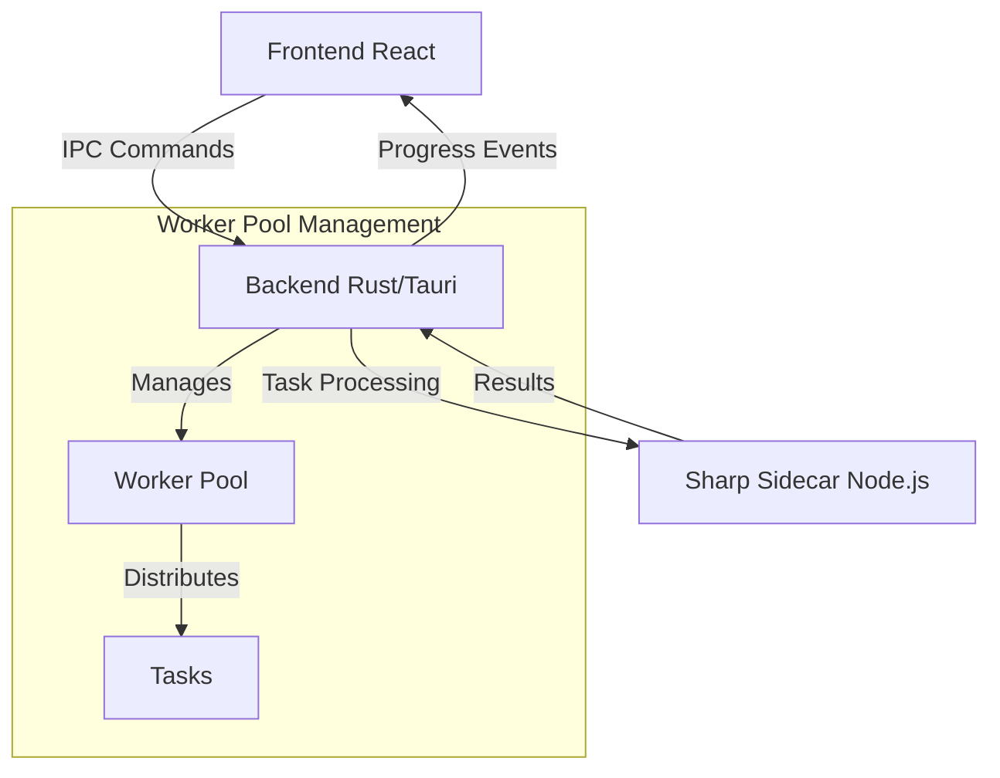
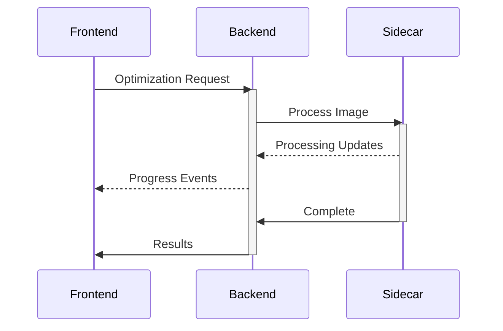
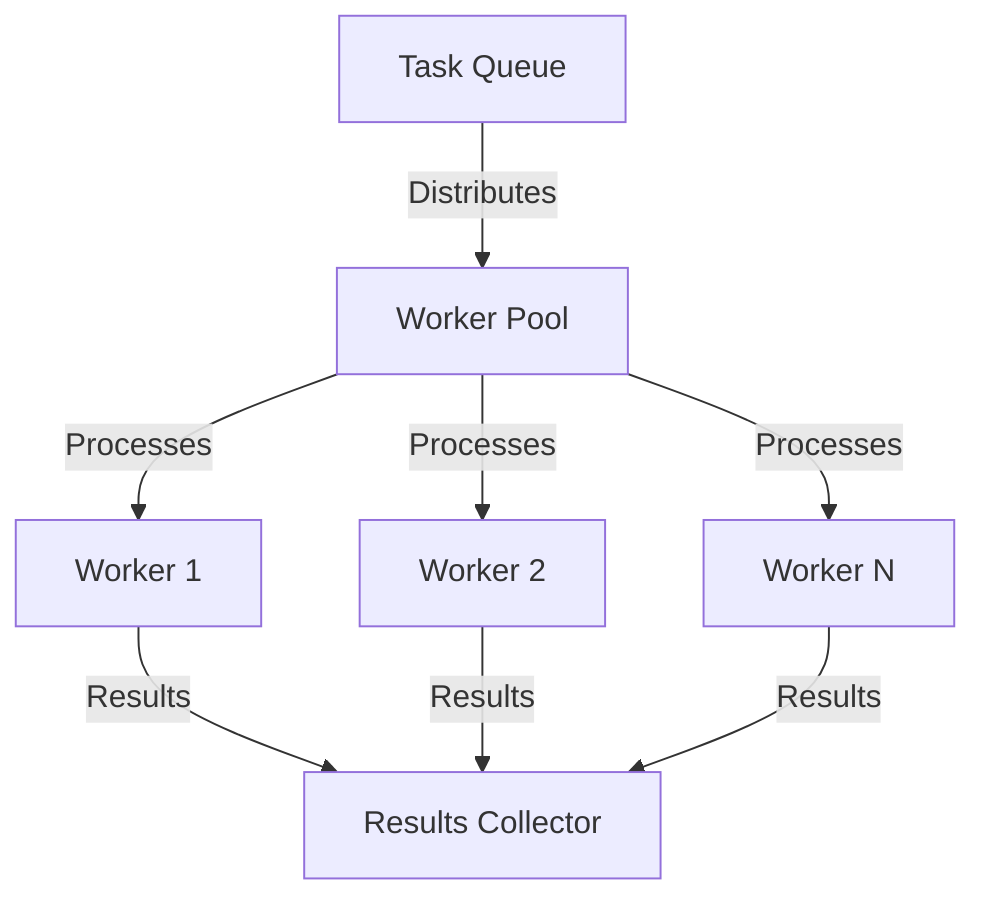
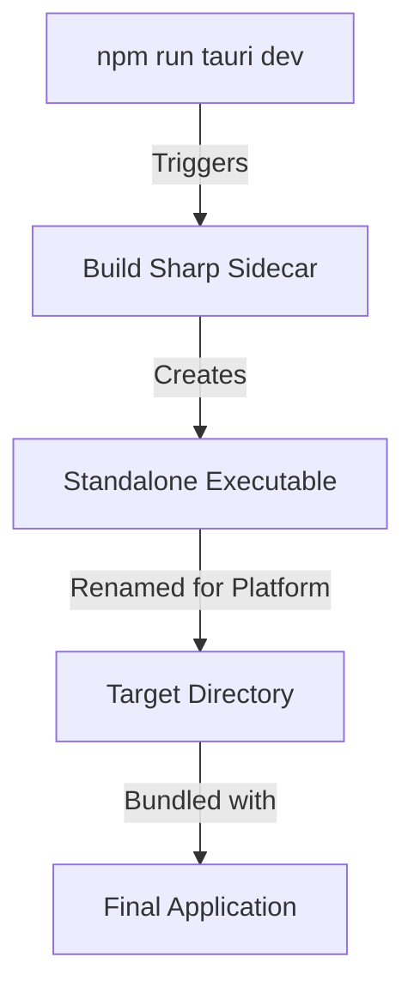

# Image Optimizer - Technical Documentation

## Table of Contents
1. [System Overview](#system-overview)
2. [Architecture Components](#architecture-components)
3. [Core Features](#core-features)
4. [Build Process](#build-process)
5. [Performance & Monitoring](#performance--monitoring)
6. [Security Considerations](#security-considerations)

## System Overview

The Image Optimizer is a high-performance desktop application designed for efficient image processing. Built with a modern multi-layered architecture, it combines React, Rust, and Node.js to deliver optimal performance and user experience.

### Architecture Overview



### Component Communication Flow



## Architecture Components

### Frontend (React)

The frontend provides an intuitive user interface with drag-and-drop functionality and real-time progress tracking. Key features include:

- Global state management for optimization settings and progress
- Real-time performance metrics display
- Advanced settings interface with format-specific controls
- Progress tracking and visualization

Essential state management implementation:

```javascript
const [settings, setSettings] = useState({
  quality: {
    global: 90,
    jpeg: null,
    png: null,
    webp: null,
    avif: null
  },
  resize: {
    width: null,
    height: null,
    maintainAspect: true,
    mode: 'none'
  },
  outputFormat: 'original'
});
```

### Backend (Rust/Tauri)

The Rust backend coordinates image processing and system integration through:

- Thread-safe process pool management
- Task distribution and queuing
- Performance metrics collection
- IPC with frontend and sidecar

Core error handling structure:

```rust
#[derive(Error, Debug, Serialize)]
pub enum OptimizerError {
    #[error("Validation error: {0}")]
    Validation(#[from] ValidationError),
    #[error("Processing error: {0}")]
    Processing(String),
    #[error("IO error: {0}")]
    IO(String)
}
```

### Sharp Sidecar (Node.js)

The Sharp sidecar handles professional-grade image processing with:

- Worker thread-based architecture
- Format-specific optimizations
- Intelligent resize operations
- Comprehensive error handling

## Core Features

### Worker Pool Architecture



### Performance Monitoring

The application implements comprehensive monitoring across all layers:

- CPU utilization tracking
- Worker performance metrics
- Task processing statistics
- Queue length monitoring

## Build Process

The build process creates platform-specific executables that bundle all components:

1. Sharp Sidecar Build
```json
{
  "scripts": {
    "build:sharp": "cd sharp-sidecar && npm run build:rename",
    "tauri": "npm run build:sharp && tauri"
  }
}
```

2. Sidecar Compilation
- Uses @yao-pkg/pkg for standalone executable creation
- Includes all necessary Sharp binaries and assets
- Platform-specific naming and placement
- Integration with Tauri's binary directory

3. Tauri Configuration
```json
{
  "bundle": {
    "externalBin": [
      "binaries/sharp-sidecar"
    ]
  }
}
```

### Build Flow



## Performance & Monitoring

The application implements multi-level performance monitoring:

- Real-time CPU and memory usage tracking
- Worker pool utilization metrics
- Task processing statistics
- Queue length and throughput monitoring

Performance data is collected and displayed through:

- Real-time metrics dashboard
- Progress visualization
- Resource utilization graphs
- Performance reports

## Security Considerations

Security measures are implemented across all layers:

1. File System Access
- Restricted to user-selected directories
- Output path validation
- Permission verification

2. Process Isolation
- Sandboxed sidecar execution
- Resource usage limits
- Secure IPC channels

3. Input Validation
- File format verification
- Path sanitization
- Settings validation

The application follows security best practices for desktop applications, ensuring safe file handling and process execution while maintaining high performance.
